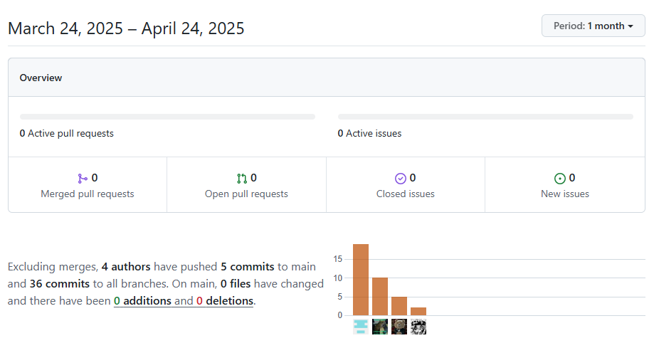

# INFORME DEL TRABAJO FINAL

### UNIVERSIDAD PERUANA DE CIENCIAS APLICADAS

### INGENIERÍA DE SOFTWARE

### CICLO 2025-01

Nombre del curso: Diseño de Experimentos de Ingeniería de Software 
NRC: 4438
Nombre del Profesor: Julio Manuel Noriega Melendez 
Nombre del StartUp: Pet-Heart-Health 
Nombre del Producto: UPet
Relación de Integrantes:

- Josehp Piero Herrera del Pino - U20211E098
- Fabricio Apaza Morales - U201922146
- Rentería Puga, Héctor Marcelo - U202216558
- Flores Avalos, Diego - U20221B394

Abril, 2025.

## Historial de Versiones

<table>
<tr>
    <th colspan="3">Version</th>
    <th colspan="3">Fecha</th>
    <th colspan="10">Autores</td>
    <th colspan="5">Descripción de Modificaciones</td>
  <tr>
    <td colspan="3">1era</td>
    <td colspan="3">10/4/2024</td>
    <td colspan="10">Héctor Marcelo Rentería Puga, Josehp Piero Herrera del Pino, Fabricio Apaza Morales, Diego Flores Avalos.</td>
    <td colspan="5">
     - Primera versión 
     - Creación del informe 
     - Capítulo 1 al 5 
  </table>

## Project Report Collaboration Insights

A continuación, se detalla el proceso de elaboración del informe para cada entrega, junto con capturas de pantalla que muestran los análisis de colaboración y commits en GitHub para el repositorio del informe:

**URL del Repositorio del Informe:** https://github.com/pet-heart-health/Project-Report-UPet

Se divieron las siguientes ramas para la colaboración en el proyecto:

- master
- develop
- chapter-i
- chapter-ii
- chapter-iii
- chapter-iv
- chapter-v
- chapter-vi

**Entregable TB1**
A continuación se presentan los gráficos de colaboración de los integrantes del equipo en el repositorio de nuestro primera entrega. Estos gráficos ofrecen una representación visual de la cantidad de contribuciones realizadas por cada miembro del equipo, junto con la fecha en que se llevaron a cabo. Además, se presenta información sobre la cantidad de líneas de código que se han modificado en cada uno de los commits.

# Student Outcome

<table> <tr> <th colspan="2">Criterio Específico</th> <th colspan="10">Acciones Realizadas</th> <th colspan="2">Conclusiones</th> </tr> <tr> <td colspan="2">Capacidad para explorar de manera exhaustiva problemas, idea o eventos para formular conclusiones u opiniones sólidamente justificadas.</td> <td colspan="10"><b>Héctor Marcelo Rentería Puga</b>  TB1: Manejé los User Stories y el sprint. <b>Josehp Piero Herrera del Pino</b> TB1: Me encargué de realizar los diagramas de arquitectura c4 considerando todos nuestros requisitos funcionales y también elaboré el diseño de nuestros sistemas en el lado del frontend <b>Diego Flores Avalos</b> TB1: Colaboré en correción del Front y Backend con respecto a lo solicitado. A su vez, elaboré el capitulo I.  <b>Fabricio Apaza Morales</b>  TB1: Realicé el capitulo II del informe, más algunas correcciones de información y estilos.  </td> <td colspan="2">.</td> </tr> <tr> <td colspan="2">Emite juicios informados considerando el impacto de las soluciones de ingeniería de software en contextos globales, económicos, ambientales y sociales.</td> <td colspan="10"><b>Héctor Marcelo Rentería Puga</b>  TB1: Controlé el estado de la iteración, asegurando que los productos funcionen cómo deberían al ser mostrados al cliente. <b>Josehp Piero Herrera del Pino</b> TB1: Verifiqué la correcta estructura de los diagramas arquitéctonicos para que esten alineados con nuestros objetivos <b>Diego Flores Avalos</b> TB1: Colaboré en correción del Front y Backend con respecto a lo solicitado. A su vez, elaboré el capitulo I.  <b>Fabricio Apaza Morales</b>  TB1: Realicé el capitulo II del informe, más algunas correcciones de información y estilos.  </td> <td colspan="2">.</td> </tr> </table>
