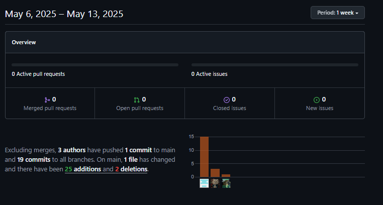

# INFORME DEL TRABAJO FINAL

### UNIVERSIDAD PERUANA DE CIENCIAS APLICADAS

### INGENIERÍA DE SOFTWARE

### CICLO 2025-01

Nombre del curso: Diseño de Experimentos de Ingeniería de Software 
NRC: 4438
Nombre del Profesor: Julio Manuel Noriega Melendez 
Nombre del StartUp: Pet-Heart-Health 
Nombre del Producto: UPet
Relación de Integrantes:

- Josehp Piero Herrera del Pino - U20211E098
- Fabricio Apaza Morales - U201922146
- Rentería Puga, Héctor Marcelo - U202216558
- Flores Avalos, Diego - U20221B394

Abril, 2025.

## Historial de Versiones

<table>
<tr>
    <th colspan="3">Version</th>
    <th colspan="3">Fecha</th>
    <th colspan="10">Autores</td>
    <th colspan="5">Descripción de Modificaciones</td>
  <tr>
    <td colspan="3">1era</td>
    <td colspan="3">10/4/2024</td>
    <td colspan="10">Héctor Marcelo Rentería Puga, Josehp Piero Herrera del Pino, Fabricio Apaza Morales, Diego Flores Avalos.</td>
    <td colspan="5">
     - Primera versión 
     - Creación del informe 
     - Capítulo 1 al 5 
  </tr>
    <tr>
        <td colspan="3">2da</td>
    <td colspan="3">13/5/2024</td>
    <td colspan="10">Héctor Marcelo Rentería Puga, Josehp Piero Herrera del Pino, Fabricio Apaza Morales, Diego Flores Avalos.</td>
    <td colspan="5">
     - Segunda versión 
     - Pruebas 
     - Capítulo 5 al 7 
    </tr>
    <tr>
        <td colspan="3">3ra</td>
    <td colspan="3">19/6/2024</td>
    <td colspan="10">Héctor Marcelo Rentería Puga, Josehp Piero Herrera del Pino, Fabricio Apaza Morales, Diego Flores Avalos.</td>
    <td colspan="5">
     - Tercera versión 
     - Experimentos 
     - Capítulo 5 al 8 
    </tr>
  </table>

## Índice:

[Part I: As-Is Software Project 
Capítulo I: Introducción 
1.1. Startup Profile 
1.1.1. Descripción de la Startup 
1.1.2. Perfiles de integrantes del equipo 
1.2. Solution Profile 
1.2.1. Antecedentes y problemática 
1.2.2. Lean UX Process. 
1.2.2.1. Lean UX Problem Statements. 
1.2.2.2. Lean UX Assumptions. 
1.2.2.3. Lean UX Hypothesis Statements. 
1.2.2.4. Lean UX Canvas. 
1.3. Segmentos objetivo.](https://github.com/pet-heart-health/Project-Report-UPet/blob/chapter-i/docs/chapter-i.md)

[Capítulo II: Requirements Elicitation & Analysis 
2.1. Competidores. 
2.1.1. Análisis competitivo. 
2.1.2. Estrategias y tácticas frente a competidores. 
2.2. Entrevistas. 
2.2.1. Diseño de entrevistas. 
2.2.2. Registro de entrevistas. 
2.2.3. Análisis de entrevistas. 
2.3. Needfinding. 
2.3.1. User Personas. 
2.3.2. User Task Matrix. 
2.3.3. User Journey Mapping. 
2.3.4. Empathy Mapping. 
2.3.5. As-is Scenario Mapping. 
2.4. Ubiquitous Language.](https://github.com/pet-heart-health/Project-Report-UPet/blob/chapter-ii/docs/chapter-ii.md)

[Capítulo III: Requirements Specification 
3.1. To-Be Scenario Mapping. 
3.2. User Stories. 
3.3. Product Backlog. 
3.4. Impact Mapping.](https://github.com/pet-heart-health/Project-Report-UPet/blob/chapter-iii/docs/chapter-iii.md)

[Capítulo IV: Product Design 
4.1. Style Guidelines. 
4.1.1. General Style Guidelines. 
4.1.2. Web Style Guidelines. 
4.1.3. Mobile Style Guidelines. 
4.1.3.1. iOS Mobile Style Guidelines. 
4.1.3.2. Android Mobile Style Guidelines. 
4.2. Information Architecture. 
4.2.1. Organization Systems. 
4.2.2. Labeling Systems. 
4.2.3. SEO Tags and Meta Tags 
4.2.4. Searching Systems. 
4.2.5. Navigation Systems. 
4.3. Landing Page UI Design. 
4.3.1. Landing Page Wireframe. 
4.3.2. Landing Page Mock-up. 
4.4. Mobile Applications UX/UI Design. 
4.4.1. Mobile Applications Wireframes. 
4.4.2. Mobile Applications Wireflow Diagrams. 
4.4.3. Mobile Applications Mock-ups. 
4.4.4. Mobile Applications User Flow Diagrams. 
4.5. Mobile Applications Prototyping. 
4.5.1. Android Mobile Applications Prototyping. 
4.5.2. iOS Mobile Applications Prototyping. 
4.6. Web Applications UX/UI Design. 
4.6.1. Web Applications Wireframes. 
4.6.2. Web Applications Wireflow Diagrams. 
4.6.3. Web Applications Mock-ups. 
4.6.4. Web Applications User Flow Diagrams. 
4.7. Web Applications Prototyping. 
4.8. Domain-Driven Software Architecture. 
4.8.1. Software Architecture Context Diagram. 
4.8.2. Software Architecture Container Diagrams. 
4.8.3. Software Architecture Components Diagrams 
4.9. Software Object-Oriented Design. 
4.9.1. Class Diagrams. 
4.9.2. Class Dictionary. 
4.10. Database Design. 
4.10.1. Relational/Non-Relational Database Diagram.](https://github.com/pet-heart-health/Project-Report-UPet/blob/chapter-iv/docs/chapter-iv.md)

[Capítulo V: Product Implementation 
5.1. Software Configuration Management. 
5.1.1. Software Development Environment Configuration. 
5.1.2. Source Code Management. 
5.1.3. Source Code Style Guide & Conventions. 
5.1.4. Software Deployment Configuration. 
5.2. Product Implementation & Deployment. 
5.2.1. Sprint Backlogs. 
5.2.2. Implemented Landing Page Evidence 
5.2.3. Implemented Frontend-Web Application Evidence 
5.2.4. Acuerdo de Servicio - SaaS 
5.2.5. Implemented Native-Mobile Application Evidence 
5.2.6. Implemented RESTful API and/or Serverless Backend Evidence 
5.2.7. RESTful API documentation 
5.2.8. Team Collaboration Insights 
5.3. Video About-the-Product.](https://github.com/pet-heart-health/Project-Report-UPet/blob/chapter-v/docs/chapter-v.md)

[Part II: Verification, Validation & Pipeline 
Capítulo VI: Product Verification & Validation 
6.1. Testing Suites & Validation 
6.1.1. Core Entities Unit Tests. 
6.1.2. Core Integration Tests. 
6.1.3. Core Behavior-Driven Development 
6.1.4. Core System Tests.](https://github.com/pet-heart-health/Project-Report-UPet/blob/chapter-vi/docs/chapter-vi.md)

[Capítulo VII: DevOps Practices 
7.1. Continuous Integration 
7.1.1. Tools and Practices. 
7.1.2. Build & Test Suite Pipeline Components. 
7.2. Continuous Delivery 
7.2.1. Tools and Practices. 
7.2.2. Stages Deployment Pipeline Components. 
7.3. Continuous deployment 
7.3.1. Tools and Practices. 
7.3.2. Production Deployment Pipeline Components. 
7.4. Continuous Monitoring 
7.4.1. Tools and Practices 
7.4.2. Monitoring Pipeline Components 
7.4.3. Alerting Pipeline Components 
7.4.4. Notification Pipeline Components.](https://github.com/pet-heart-health/Project-Report-UPet/blob/chapter-vii/docs/chapter-vii.md)

[Part III: Experiment-Driven Lifecycle 
Capítulo VIII: Experiment-Driven Development 
8.1. Experiment Planning 
8.1.1. As-Is Summary. 
8.1.2. Raw Material: Assumptions, Knowledge Gaps, Ideas, Claims. 
8.1.3. Experiment-Ready Questions. 
8.1.4. Question Backlog. 
8.1.5. Experiment Cards. 
8.2. Experiment Design 
8.2.1. Hypotheses. 
8.2.2. Measures. 
8.2.3. Conditions. 
8.2.4. Scale Calculations and Decisions. 
8.2.5. Methods Selection. 
8.2.6. Data Analytics: Goals, KPIs and Metrics Selection. 
8.2.7. Web and Mobile Tracking Plan. 
8.3. Experimentation 
8.3.1. To-Be User Stories. 
8.3.2. To-Be Product Backlog](https://github.com/pet-heart-health/Project-Report-UPet/blob/chapter-viii/docs/chapter-viii.md)

## Project Report Collaboration Insights

A continuación, se detalla el proceso de elaboración del informe para cada entrega, junto con capturas de pantalla que muestran los análisis de colaboración y commits en GitHub para el repositorio del informe:

**URL del Repositorio del Informe:** https://github.com/pet-heart-health/Project-Report-UPet

Se divieron las siguientes ramas para la colaboración en el proyecto:

- master
- develop
- chapter-i
- chapter-ii
- chapter-iii
- chapter-iv
- chapter-v
- chapter-vi
- chapter-vii

A continuación se presentan los gráficos de colaboración de los integrantes del equipo en el repositorio de nuestro primera entrega. Estos gráficos ofrecen una representación visual de la cantidad de contribuciones realizadas por cada miembro del equipo, junto con la fecha en que se llevaron a cabo. Además, se presenta información sobre la cantidad de líneas de código que se han modificado en cada uno de los commits.

# Student Outcome

<table> <tr> <th colspan="2">Criterio Específico</th> <th colspan="10">Acciones Realizadas</th> <th colspan="2">Conclusiones</th> </tr>
    <tr> <td colspan="2">Capacidad para explorar de manera exhaustiva problemas, idea o eventos para formular conclusiones u opiniones sólidamente justificadas.</td> <td colspan="10">
        <b>Héctor Marcelo Rentería Puga</b>  TB1: Manejé los User Stories y el sprint. TP: Manejé el Sprint Backlog, y la integración de la solución. TB2: Manejé el Sprint Backlog, y la integración de la solución. 
        <b>Josehp Piero Herrera del Pino</b> TB1: Me encargué de realizar los diagramas de arquitectura c4 considerando todos nuestros requisitos funcionales y también elaboré el diseño de nuestros sistemas en el lado del frontend TB2: Investigué y documenté la implementación de DevOps Practices. TB2: Hice pruebas de KPI, para formular soluciones a los análisis. 
        <b>Diego Flores Avalos</b> TB1: Colaboré en correción del Front y Backend con respecto a lo solicitado. A su vez, elaboré el capitulo I.  TP: Agregué prácticas de seguridad a la plataforma. TB2: Elaboré hipotésis del estado del proyecto. 
        <b>Fabricio Apaza Morales</b>  TB1: Realicé el capitulo II del informe, más algunas correcciones de información y estilos.  TP: Realicé los Términos y Servicios de la plataforma. TB2: Elaboré hipotésis del estado del proyecto. </td>
        <td colspan="2">.</td>
    </tr> <tr> <td colspan="2">Emite juicios informados considerando el impacto de las soluciones de ingeniería de software en contextos globales, económicos, ambientales y sociales.</td> <td colspan="10">
        <b>Héctor Marcelo Rentería Puga</b>  TB1: Controlé el estado de la iteración, asegurando que los productos funcionen cómo deberían al ser mostrados al cliente. TP: Realicé pruebas funcionales, asegurando que la solución cumpla lo planteado. TB2: Hice preparativos para los experimentos. 
        <b>Josehp Piero Herrera del Pino</b> TB1: Verifiqué la correcta estructura de los diagramas arquitéctonicos para que esten alineados con nuestros objetivos  TP: Realicé pruebas integrales, asegurando que la solución cumpla lo planteado. TB2: Realicé pruebas, e implementaciones. 
        <b>Diego Flores Avalos</b> TB1: Colaboré en correción del Front y Backend con respecto a lo solicitado. A su vez, elaboré el capitulo I.   TP: Realicé pruebas de comportamiento, asegurando que la solución cumpla lo planteado. TB2: Hice preparativos para los experimentos. 
        <b>Fabricio Apaza Morales</b>  TB1: Realicé el capitulo II del informe, más algunas correcciones de información y estilos.  TP: Realicé pruebas unitarias, asegurando que la solución cumpla lo planteado. TB2: Realicé prubeas, e implementaciones. </td>
        <td colspan="2">.</td> </tr> </table>
