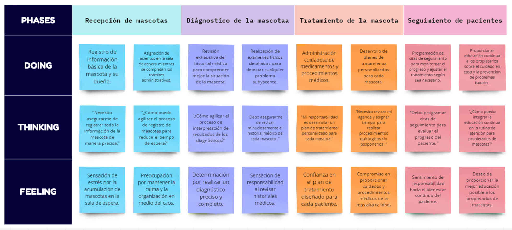
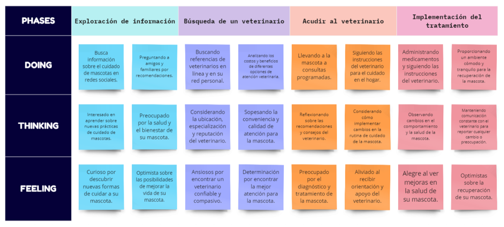

# Capítulo III: Requirements Specification.

## 3.1. To-Be Scenario Mapping.

En esta sección, se presenta el To Be Scenario Mapping para cada segmento objetivo. Esta herramienta permite visualizar y definir el proceso mejorado. A través de este mapeo, se identificaron las áreas clave de mejora y se establecieron las acciones necesarias para optimizar el rendimiento y la eficiencia en cada segmento.

### Segmento 1: Veterinaria

### Segmento 2: Propietario de mascota

