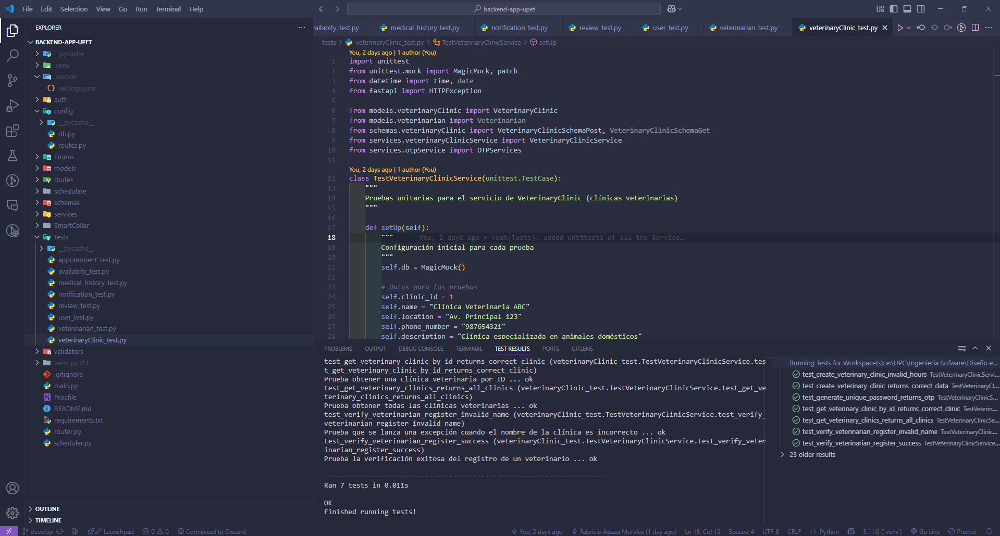

# Part II: Verification, Validation & Pipeline

# Capítulo VI: Product Verification & Validation

## 6.1. Testing Suites & Validation
### 6.1.1. Core Entities Unit Tests.
Para la elaboración de los principales tests del Backend de nuestro proyecto, hemos tenido en cuenta las secciones más importantes.

**Appointment Service Test**

**Availability Service Test**

**Medical History Service Test**

**Notification Service Test**

**Review Service Test**

**User Service Test**

**Veterinarian Service Test**

**Veterinary Clinic Service Test**

### 6.1.2. Core Integration Tests.
### 6.1.3. Core Behavior-Driven Development
### 6.1.4. Core System Tests
