# Part II: Verification, Validation & Pipeline

# Capítulo VI: Product Verification & Validation

## 6.1. Testing Suites & Validation
### 6.1.1. Core Entities Unit Tests.
Para la elaboración de los principales tests del Backend de nuestro proyecto, hemos tenido en cuenta las secciones más importantes.

**Appointment Service Test**

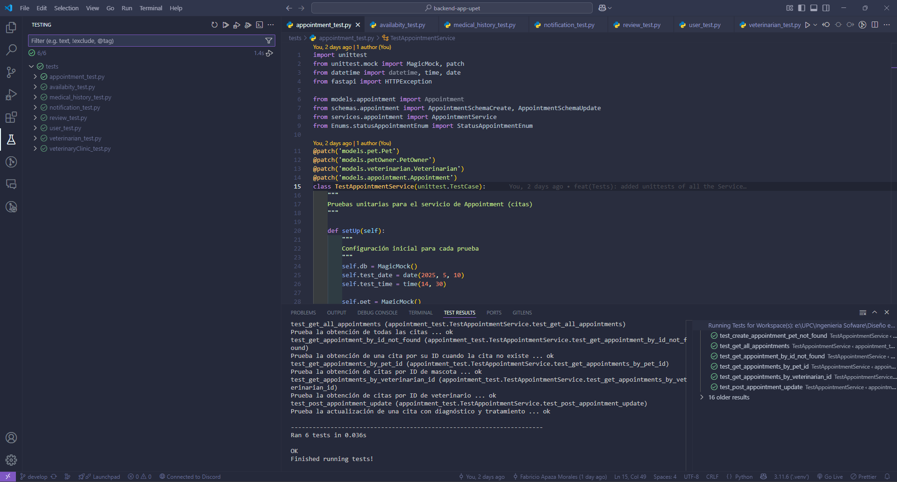

**Availability Service Test**

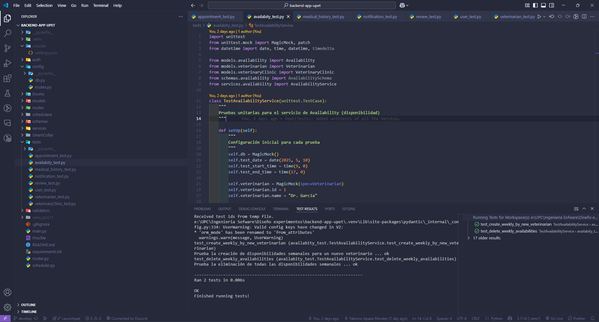

**Medical History Service Test**

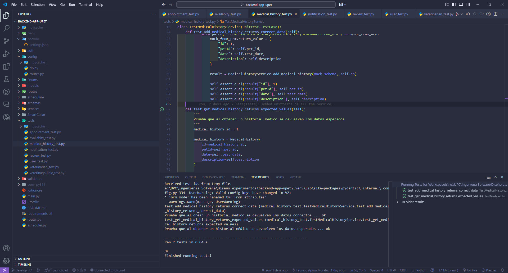

**Notification Service Test**

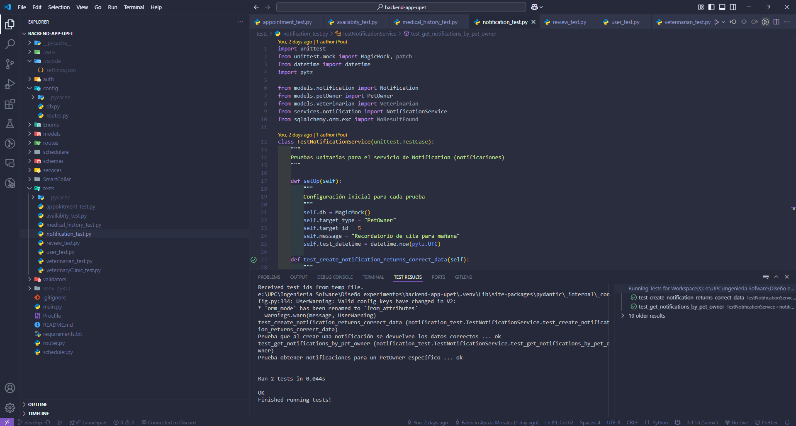

**Review Service Test**

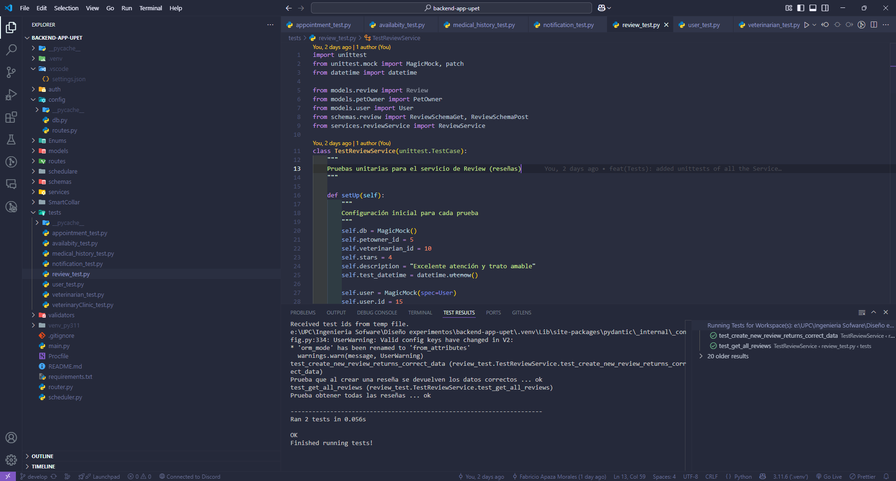

**User Service Test**

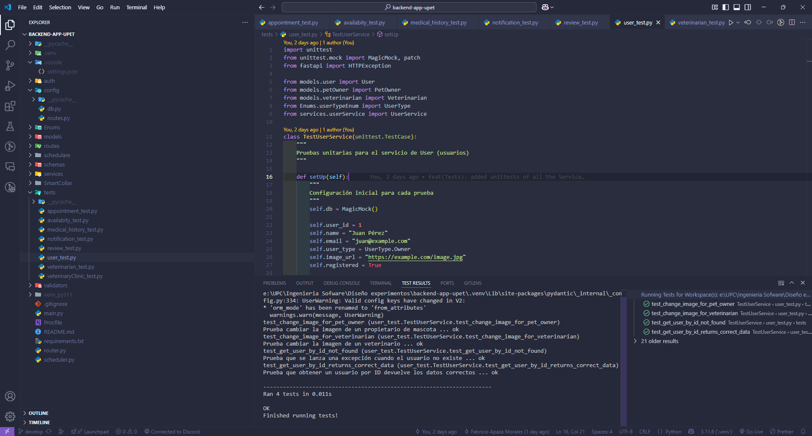

**Veterinarian Service Test**

**Veterinary Clinic Service Test**

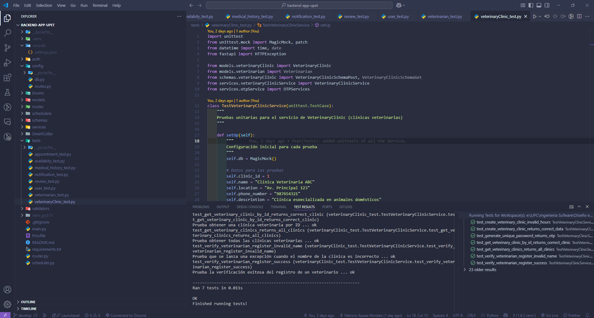

### 6.1.2. Core Integration Tests.

**OTP**
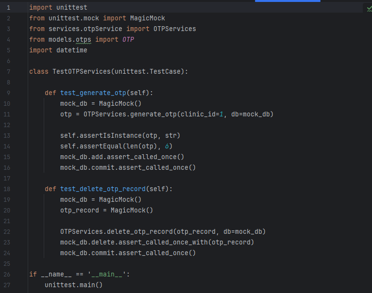

### 6.1.3. Core Behavior-Driven Development
**Features**

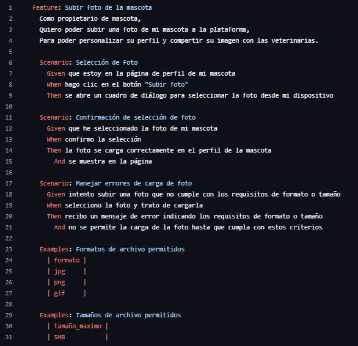

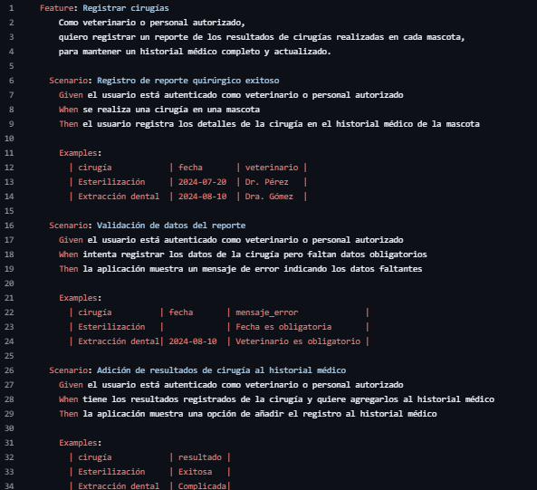

### 6.1.4. Core System Tests
Usando Selenium IDE, hemos probado el funcionamiento de las pantallas principales de nuestro frontend web application.

**Registrar Mascota**
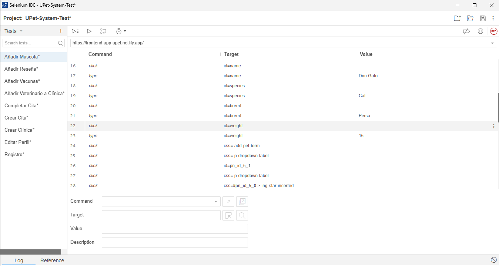

**Añadir Reseña**
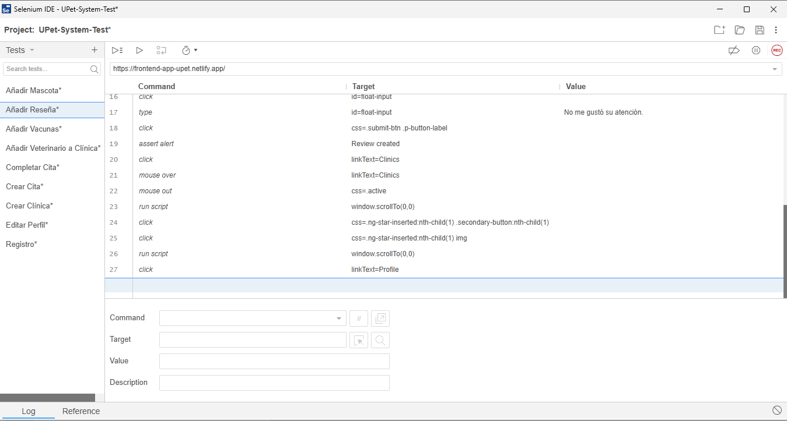

**Registrar Vacunas**
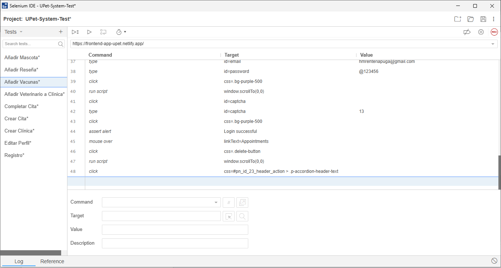

**Añadir Veterinario a Clínica**
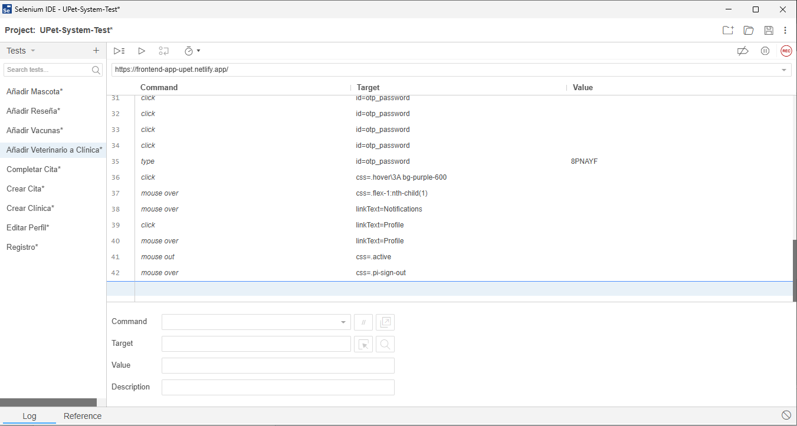

**Confirmar Cita**
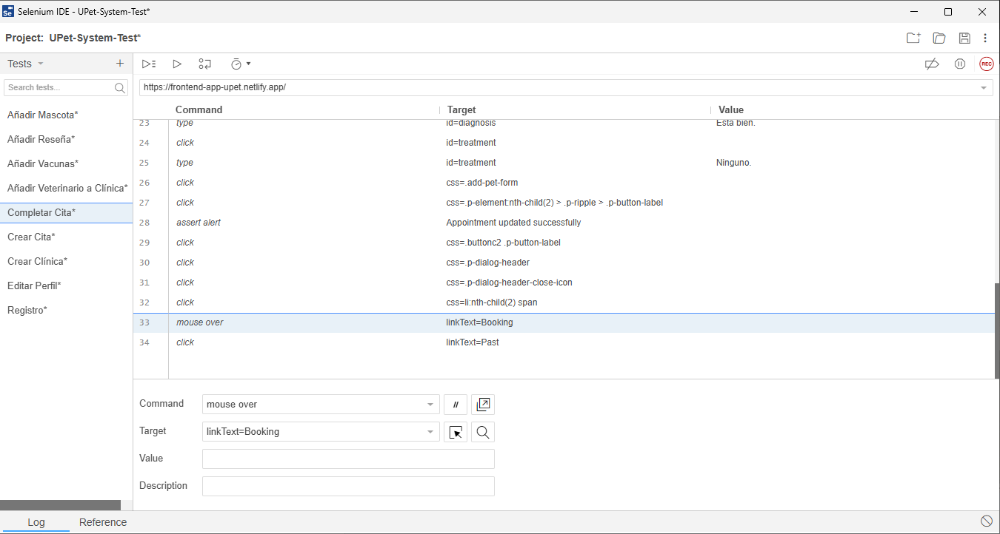

**Registrar Cita**
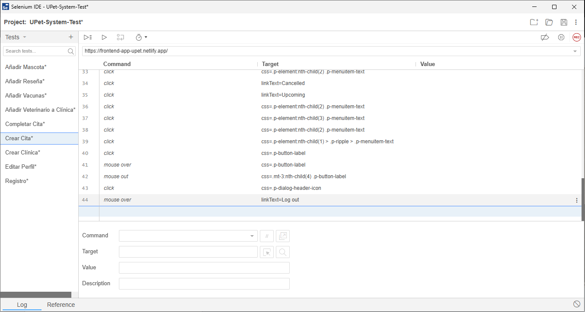

**Registrar Clínica**
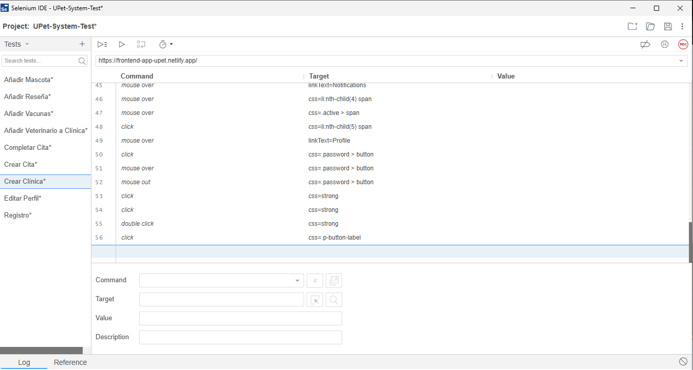

**Editar Perfil**
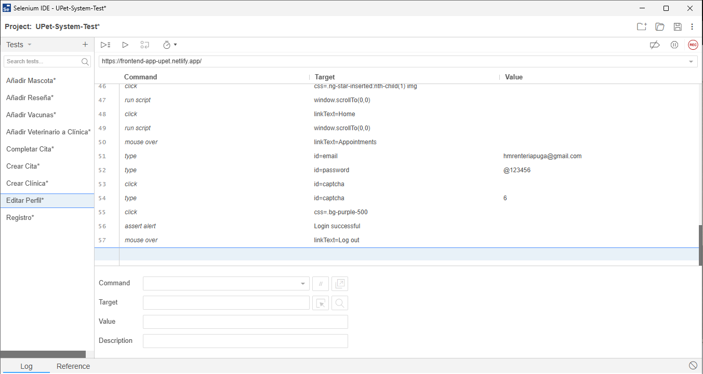

**Registrar Cuenta**
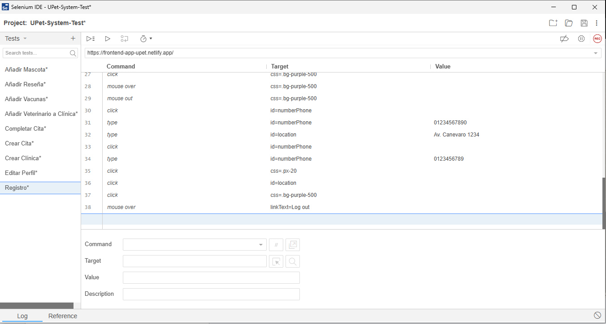

### 6.3.2. Registro de Entrevistas.

Entrevista Segmento Dueño de Mascotas
<table>
        <thead>
            <tr>
                <th>Entrevistado</th>
                <th>Karen Mora</th>
            </tr>
            <tr>
                <th>Entrevistador</th>
                <th>Randy Rengifo</th>
            </tr>
        </thead>
        <tbody>
            <tr>
                <td>Edad</td>
                <td>33 </td>
            </tr>
            <tr>
                <td>Pais</td>
                <td>Mexico</td>
            </tr>
            <tr>
                <td></td>
                <td><strong>Resumen:</strong> 
                    Karen nos indica que el diseño a la aplicacion es muy intuitivo y completa, Tambien menciona que si en un futuro se pueda implementar para el monitero de la glucosa de la mascota.
                </td>
            </tr>
            <tr>
                <td>Timing de la entrevista</td>
                <td> 08:28:28  </td>
            </tr>
            <tr>
                <td>URL de la entrevista</td>
                <td>https://drive.google.com/file/d/1G4MbjdGH8B0AXOwp2vBNSZ6iA7ldb3D3/view?usp=sharing</td>
            </tr>
        </tbody>
</table>

<table>
        <thead>
            <tr>
                <th>Entrevistado</th>
                <th>Julio Reyes</th>
            </tr>
            <tr>
                <th>Entrevistador</th>
                <th>Enzo Trujillo</th>
            </tr>
        </thead>
        <tbody>
            <tr>
                <td>Edad</td>
                <td>20 </td>
            </tr>
            <tr>
                <td>Distrito</td>
                <td>Los Olivos</td>
            </tr>
            <tr>
                <td></td>
                <td><strong>Resumen:</strong> 
                   El entrevistado expresó que el prototipo de IoT para monitoreo de signos vitales fue bien recibido. También destacó que la gestión de citas veterinarias era muy eficiente y rápida.
                </td>
            </tr>
            <tr>
                <td>Timing de la entrevista</td>
                <td> 02:24 </td>
            </tr>
            <tr>
                <td>URL de la entrevista</td>
                <td>https://youtu.be/qJxjZNYhkA4</td>
            </tr>
        </tbody>
</table>
