# Capítulo VIII: Experiment-Driven Development

## 8.1. Experiment Planning

### 8.1.1. As-Is Summary

La aplicación actual se centra en ofrecer una plataforma para facilitar el contacto de veterinarios para tratar sus mascotas, proporcionando funcionalidades básicas como la gestión de perfiles de usuarios, reportes médicos y datos de los animales, y un sistema de recordatorios para citas agendadas con el veterinario. Sin embargo, el rendimiento general es inconsistente, con la función de elección de ubicación funcionando irregularmente, y cambios no mostrándose hasta actualizar la página, lo que afecta la experiencia del usuario. La interfaz presenta limitaciones en términos de personalización, y no se adapta adecuadamente a diferentes condiciones de luz.

### 8.1.2. Raw Material: Assumptions, Knowledge Gaps, Ideas, Claims

**Assumptions:**

- _Modo Oscuro_: Se asume que los usuarios valoran que el diseño de la interfaz se acomode a sus preferencias visuales.

- _Olvido de vacunación_: Se asume que muchos dueños de mascotas olvidan las fechas de vacunación si no cuentan con recordatorios automáticos.

- _Clínicas veterinarias favoritas_: Se asume que los usuarios querrán guardar como favoritas las clínicas que ya conocen o en las que confían, para encontrarlas más rápido en el futuro.

- _Segmentación de perfil de mascota favorita_: Se asume que los usuarios querrán no solo guardar clínicas favoritas, sino también establecer perfiles completos incluyendo, fotos, información de raza, edad y métricas.

**Knowledge Gaps:**

- _Preferencias de Interfaz_: Falta información sobre las preferencias que tienen los usuarios respecto al diseño de la interfaz.

- _Frecuencia del olvido_: No se tiene información precisa sobre cuántos usuarios han olvidado citas o vacunas importantes para sus mascotas.

- _Frecuencia de citas en la misma clínica_: No se sabe cuántos usuarios repiten de clínica veterinaria en sus citas, ni si realmente necesitan una opción de “favoritos”

- _Cambio de idioma_: Falta información sobre si los usuarios requieren que la aplicación esté disponible en múltiples idiomas, especialmente considerando que muchos dueños de mascotas pueden preferir usar la aplicación en su idioma nativo para una mejor comprensión de términos médicos veterinarios.

**Ideas:**

- _Entrevistas_: Realizar entrevistas a los usuarios, en los que preguntamos y recolectamos información sobre sus preferencias.

- _Funcionalidad de recordatorios_: Implementar una funcionalidad que envíe notificaciones automáticas antes de las fechas de vacunación, y medir su impacto con encuestas o métricas de cumplimiento.

- _Botón de guardar como favorita_: Agregar un botón de “guardar como favorita” en el perfil de cada clínica, y luego analizar cuántas veces es usado y con qué frecuencia se agenda con esas clínicas favoritas.

- _Dashboard de métricas visuales por mascota_: Implementar un panel donde se visualicen gráficas de peso, vacunaciones, medicaciones y recordatorios por cada mascota, según prefieren algunos usuarios para aplicaciones de cuidado de mascotas .

**Claims:**

- _Experiencia más cómoda_: Se afirma que el Modo Oscuro proporcionará una experiencia más cómoda a los usuarios.

- _Mejora de cumplimiento_: Se afirma que al incluir recordatorios automáticos de vacunación, se mejora la salud preventiva de las mascotas y se reduce el riesgo de enfermedades comunes.

- _Eficiencia al agendar citas_: Se afirma que permitir guardar veterinarias favoritas mejora la rapidez al agendar citas y refuerza el vínculo con clínicas confiables.

- _Mejora de la toma de decisiones preventivas_: Se afirma que al ofrecer gráficos y tendencias de salud por mascota (peso, vacunas, programaciones), los dueños estarán mejor informados y tomarán decisiones proactivas de salud (e.g., detectar aumento de peso o falta de vacunación).

### 8.1.3. Experiment-Ready Questions

| Question                                                                                                                                                                                                      | Confidence                                                                                                                                                                                                             | Risk                                                                                                                                      | Impact                                                                                                                                                                | Interest                                                                                                                                        | Total Score |
| ------------------------------------------------------------------------------------------------------------------------------------------------------------------------------------------------------------- | ---------------------------------------------------------------------------------------------------------------------------------------------------------------------------------------------------------------------- | ----------------------------------------------------------------------------------------------------------------------------------------- | --------------------------------------------------------------------------------------------------------------------------------------------------------------------- | ----------------------------------------------------------------------------------------------------------------------------------------------- | ----------- |
| ¿Un Modo Oscuro mejoraría la experiencia?                                                                                                                                                                     | 8 - Varias aplicaciones lo tienen, y el porcentaje de uso es notable.                                                                                                                                                  | 2 - Bajo riesgo, ya que es una funcionalidad sencilla de colores                                                                          | 5 - Mejora la experiencia, pero no es esencial.                                                                                                                       | 5 - Interés moderado en los usuarios.                                                                                                           | 20          |
| ¿La implementación de recordatorios de vacunación aumentará el cumplimiento del calendario de salud de las mascotas?                                                                                          | 7 – Es una práctica común en apps de salud y organización, pero no tenemos datos específicos de nuestros usuarios aún.                                                                                                 | 3 – Riesgo bajo-moderado: requiere integración con historial médico y sistema de notificaciones.                                          | 8 – Tiene alto impacto en la salud de las mascotas y fidelización de usuarios.                                                                                        | 7 – Alta probabilidad de interés: dueños responsables valoran el cuidado preventivo.                                                            | 25          |
| ¿Permitir guardar veterinarias como favoritas mejora la rapidez para agendar y refuerza la relación con clínicas conocidas?                                                                                   | 7 – Varias plataformas similares permiten guardar elementos favoritos; es una práctica común                                                                                                                           | 2 – Bajo riesgo técnico, ya que no modifica el código existente                                                                           | 5 – Mejora la experiencia, pero no es una funcionalidad crítica.                                                                                                      | 6 – Probable interés entre usuarios frecuentes o con clínicas de preferencia.                                                                   | 20          |
| ¿Implementar cambio de idioma mejorará la accesibilidad y satisfacción de usuarios que prefieren usar la aplicación en su idioma nativo?                                                                     | 6 – Es una práctica común en aplicaciones globales, especialmente importante en contextos médicos donde la comprensión precisa es crucial                                                                              | 2 – Bajo riesgo técnico: implementación estándar de i18n                                                                                 | 7 – Alto impacto en accesibilidad y comprensión de términos médicos veterinarios, especialmente para usuarios no nativos del idioma principal                        | 8 – Alto interés: usuarios valoran poder usar apps en su idioma preferido para mejor comprensión                                              | 23          |

### 8.1.4. Question Backlog

| Prioridad | Pregunta                                                                                                                                                                      |
| --------- | ----------------------------------------------------------------------------------------------------------------------------------------------------------------------------- |
| 1         | ¿Un Modo Oscuro mejoraría la experiencia?                                                                                                                                     |
| 2         | ¿Los recordatorios ayudarán a que los dueños de mascotas cumplan a tiempo con las vacunas?                                                                                    |
| 3         | ¿Permitir guardar veterinarias como favoritas mejora la rapidez para agendar y refuerza la relación con clínicas conocidas?                                                   |
| 4         | ¿Implementar cambio de idioma mejorará la accesibilidad y satisfacción de usuarios que prefieren usar la aplicación en su idioma nativo?                                     |

### 8.1.5. Experiment Cards

| Question   | ¿Un Modo Oscuro mejoraría la experiencia?                                                                                                                               |
| ---------- | ----------------------------------------------------------------------------------------------------------------------------------------------------------------------- |
| Why        | Al agregar un modo oscuro, la visibilidad y comodidad de la interfaz sería mayor para los usuarios que prefieran estos colores, especialmente en ambientes de luz baja. |
| What       | Implementar un botón que cambie entre ambos modos de color.                                                                                                             |
| Hypothesis | Se espera que, al añadir el modo oscuro, el tiempo de uso de la aplicación por parte del 50% de los usuarios aumente en un 30%.                                         |

| Question   | ¿Los recordatorios ayudarán a que los dueños de mascotas cumplan a tiempo con las vacunas?                                                                                                                     |
| ---------- | -------------------------------------------------------------------------------------------------------------------------------------------------------------------------------------------------------------- |
| Why        | Porque muchos usuarios no llevan un control estricto del calendario de vacunación de sus mascotas, lo que puede afectar su salud. Un recordatorio automático podría ayudarles a no olvidar fechas importantes. |
| What       | Implementar una funcionalidad que permita registrar fechas de vacunación y enviar notificaciones previas al usuario (por ejemplo, 3 días antes, 1 día antes y el mismo día).                                   |
| Hypothesis | Se espera que, con los recordatorios activos, al menos el 60% de los usuarios registrados con mascotas vacunadas cumplan sus citas a tiempo durante el primer mes.                                             |

| Question   | ¿Permitir guardar veterinarias como favoritas mejora la rapidez para agendar y refuerza la relación con clínicas conocidas?                                                    |
| ---------- | ------------------------------------------------------------------------------------------------------------------------------------------------------------------------------ |
| Why        | Porque al permitir que los usuarios marquen como favoritas las clínicas de su confianza, se facilitará el acceso a ellas, promoviendo agendamientos más rápidos y recurrentes. |
| What       | Habilitar un botón con ícono de estrella en el perfil de cada clínica para marcarla como favorita y mostrar una sección especial con acceso rápido en el inicio de la app.     |
| Hypothesis | Se espera que al menos el 40% de los usuarios que marquen una veterinaria como favorita agenden su siguiente cita con esa misma clínica en un plazo de 30 días.                |

| Question   | ¿Implementar cambio de idioma mejorará la accesibilidad y satisfacción de usuarios que prefieren usar la aplicación en su idioma nativo?                                     |
| ---------- | ----------------------------------------------------------------------------------------------------------------------------------------------------------------------------- |
| Why        | Muchos usuarios prefieren usar aplicaciones en su idioma nativo para mejor comprensión, especialmente en contextos médicos donde la precisión en la comunicación es crucial. |
| What       | Implementar sistema de internacionalización (i18n) con soporte para múltiples idiomas y detección automática del idioma del dispositivo.                                      |
| Hypothesis | Se espera que al menos el 70% de los usuarios que cambien el idioma a su preferido muestren mayor tiempo de uso y satisfacción con la aplicación.                            |

# 8.2. Experiment Design

### 8.2.1. Experiment Cards

|                 | Hypothesis                                                                                                                                                              |
| --------------- | ----------------------------------------------------------------------------------------------------------------------------------------------------------------------- |
| Question        | ¿Un Modo Oscuro mejoraría la experiencia?                                                                                                                               |
| Belief          | Al agregar un modo oscuro, la visibilidad y comodidad de la interfaz sería mayor para los usuarios que prefieran estos colores, especialmente en ambientes de luz baja. |
| Hypothesis      | Se espera que, al añadir el modo oscuro, el tiempo de uso de la aplicación por parte del 50% de los usuarios aumente en un 30%.                                         |
| Null Hypothesis | Al añadir el modo oscuro, el tiempo de uso de la aplicación por parte del 50% de los usuarios no se verá afectada en gran medida.                                       |

|                 | Hypothesis                                                                                                                                                                              |
| --------------- | --------------------------------------------------------------------------------------------------------------------------------------------------------------------------------------- |
| Question        | ¿Los recordatorios automáticos ayudarán a que los dueños de mascotas cumplan a tiempo con las vacunas?                                                                                  |
| Belief          | Muchos usuarios olvidan las fechas de vacunación de sus mascotas. Al ofrecer recordatorios automáticos, facilitamos el cumplimiento del calendario de salud preventiva.                 |
| Hypothesis      | Se espera que, al implementar los recordatorios, al menos el 60% de los usuarios con mascotas registradas completen sus vacunas programadas en la fecha estimada durante el primer mes. |
| Null Hypothesis | La implementación de recordatorios no generará un cambio significativo en el cumplimiento de las fechas de vacunación programadas por los usuarios.                                     |

|                 | Hypothesis                                                                                                                                                                                |
| --------------- | ----------------------------------------------------------------------------------------------------------------------------------------------------------------------------------------- |
| Question        | ¿Permitir guardar veterinarias como favoritas mejora la rapidez para agendar y refuerza la relación con clínicas conocidas?                                                               |
| Belief          | Al permitir que los usuarios marquen veterinarias como favoritas, se reducirá el tiempo que tardan en buscarlas y aumentará la probabilidad de que repitan citas en esas mismas clínicas. |
| Hypothesis      | Se espera que al menos el 40% de los usuarios que marquen una veterinaria como favorita agenden su siguiente cita con esa misma clínica en un plazo de 30 días.                           |
| Null Hypothesis | La opción de guardar veterinarias favoritas no influirá significativamente en la elección de clínica ni en el tiempo que toma agendar una cita.                                           |

|                 | Hypothesis                                                                                                                                                                                                    |
| --------------- | ------------------------------------------------------------------------------------------------------------------------------------------------------------------------------------------------------------- |
| Question        | ¿Implementar cambio de idioma mejorará la accesibilidad y satisfacción de usuarios que prefieren usar la aplicación en su idioma nativo?                                            |
| Belief          | Los usuarios valoran poder usar aplicaciones en su idioma preferido, especialmente en contextos médicos donde la comprensión precisa es fundamental.                                |
| Hypothesis      | Se espera que al menos el 70% de los usuarios que cambien el idioma a su preferido muestren mayor tiempo de uso y satisfacción con la aplicación.                                   |
| Null Hypothesis | La implementación de cambio de idioma no generará un cambio significativo en el tiempo de uso ni en la satisfacción de los usuarios.                                                |

### 8.2.2. Measures

| Question | ¿Un Modo Oscuro mejoraría la experiencia?                                                                                                                                                  |
| -------- | ------------------------------------------------------------------------------------------------------------------------------------------------------------------------------------------ |
| Measure  | Medir el tiempo de uso de los usuarios, registrando los tiempos de inicio de sesión, y su cierre correspondiente. Sacando un promedio de la mitad de los usuarios, se evaluará su impacto. |

| Question | ¿Los recordatorios automáticos ayudarán a que los dueños de mascotas cumplan a tiempo con las vacunas?                                                                                                                                         |
| -------- | ---------------------------------------------------------------------------------------------------------------------------------------------------------------------------------------------------------------------------------------------- |
| Measure  | Medir la cantidad de vacunas registradas como "cumplidas a tiempo", comparando el comportamiento de los usuarios antes y después de habilitar los recordatorios. También se pueden usar encuestas de percepción sobre la utilidad del sistema. |

| Question | ¿Permitir guardar veterinarias como favoritas mejora la rapidez para agendar y refuerza la relación con clínicas conocidas?                                                                                                                     |
| -------- | ----------------------------------------------------------------------------------------------------------------------------------------------------------------------------------------------------------------------------------------------- |
| Measure  | Medir la frecuencia con la que los usuarios agendan citas con clínicas marcadas como favoritas y el tiempo promedio que tardan en agendar una cita desde que ingresan a la app. Comparar esto con usuarios que no usan la función de favoritos. |

| Question | ¿Implementar cambio de idioma mejorará la accesibilidad y satisfacción de usuarios que prefieren usar la aplicación en su idioma nativo?                                            |
| -------- | ------------------------------------------------------------------------------------------------------------------------------------------------------------------------------------- |
| Measure  | Medir el tiempo de sesión promedio y puntuación de satisfacción (mediante encuestas) de usuarios que utilizan la aplicación en diferentes idiomas, comparando antes y después del cambio. |

### 8.2.3. Conditions

| Question               | ¿Un Modo Oscuro mejoraría la experiencia?                                               |
| ---------------------- | --------------------------------------------------------------------------------------- |
| Condición Experimental | El tiempo de uso aumentará en un 30%, medido a través de registros de tiempo de sesión. |
| Condición de Control   | No habrá un aumento significativo del tiempo de uso por parte de los usuarios.          |

| Question               | ¿Los recordatorios automáticos ayudarán a que los dueños de mascotas cumplan a tiempo con las vacunas de sus animales?                           |
| ---------------------- | ------------------------------------------------------------------------------------------------------------------------------------------------ |
| Condición Experimental | El porcentaje de cumplimiento de vacunas a tiempo será igual o mayor al 60% entre los usuarios que recibieron recordatorios.                     |
| Condición de Control   | El porcentaje de cumplimiento de vacunas a tiempo se mantendrá igual o por debajo del comportamiento base (< 40%) en usuarios sin recordatorios. |

| Question               | ¿Permitir guardar veterinarias como favoritas mejora la rapidez para agendar y refuerza la relación con clínicas conocidas?                          |
| ---------------------- | ---------------------------------------------------------------------------------------------------------------------------------------------------- |
| Condición Experimental | Al menos el 40% de los usuarios que guardaron una veterinaria como favorita agendarán su siguiente cita con la misma clínica en un plazo de 30 días. |
| Condición de Control   | No habrá una diferencia significativa en la elección de clínicas entre los usuarios que usan favoritos y los que no.                                 |

| Question               | ¿Implementar cambio de idioma mejorará la accesibilidad y satisfacción de usuarios que prefieren usar la aplicación en su idioma nativo?                    |
| ---------------------- | ------------------------------------------------------------------------------------------------------------------------------------------------------------ |
| Condición Experimental | Al menos el 70% de los usuarios que cambien a su idioma preferido mostrarán mayor satisfacción y tiempo de uso que aquellos que usan el idioma por defecto. |
| Condición de Control   | No habrá diferencia significativa en satisfacción y tiempo de uso entre usuarios que usan diferentes idiomas.                                               |

### 8.2.4. Scale Calculations and Decisions.

<table>
  <tr>
    <td rowspan="2"><strong>Scale Calculation</strong></td>
    <td rowspan="2"><strong>Decision</strong></td>
    <td colspan="4"><strong>Factor</strong></td>
  </tr>
  <tr>
    <td>Desfavorable</td>
    <td>Aceptable</td>
    <td>Ideal</td>
    <td>Excelente</td>
  </tr>
  <tr>
    <td>Creemos que, al añadir recordatorios para vacunas, los dueños de mascotas cumplirán a tiempo con las vacunas de sus animales. Sabremos que esto es cierto cuando el porcentaje de cumplimiento de vacunas a tiempo será igual o mayor al 60% entre los usuarios que recibieron recordatorios.</td>
    <td>Implementaremos un botón en el menú lateral de la aplicación que, al presionarse, intercambiaré entre modos de color.</td>
    <td></td>
    <td></td>
    <td>X</td>
    <td></td>
  </tr>
</table>

<table>
  <tr>
    <td rowspan="2"><strong>Scale Calculation</strong></td>
    <td rowspan="2"><strong>Decision</strong></td>
    <td colspan="4"><strong>Factor</strong></td>
  </tr>
  <tr>
    <td>Desfavorable</td>
    <td>Aceptable</td>
    <td>Ideal</td>
    <td>Excelente</td>
  </tr>
  <tr>
    <td>Creemos que, al permitir guardar veterinarias como favoritas, los usuarios agendarán con mayor rapidez y frecuencia con clínicas conocidas. Sabremos que esto es cierto cuando al menos el 40% de los usuarios que usen esta función reserven su siguiente cita con una clínica favorita en los próximos 30 días.</td>
    <td>Se habilitará un botón con ícono de estrella en el perfil de cada clínica veterinaria para marcarla como favorita y se mostrará una sección de acceso rápido a esas clínicas en el inicio de la app.</td>
    <td></td>
    <td></td>
    <td></td>
    <td>X</td>
  </tr>
</table>

<table>
  <tr>
    <td rowspan="2"><strong>Scale Calculation</strong></td>
    <td rowspan="2"><strong>Decision</strong></td>
    <td colspan="4"><strong>Factor</strong></td>
  </tr>
  <tr>
    <td>Desfavorable</td>
    <td>Aceptable</td>
    <td>Ideal</td>
    <td>Excelente</td>
  </tr>
  <tr>
    <td>Creemos que, al permitir guardar veterinarias como favoritas, los usuarios agendarán con mayor rapidez y frecuencia con clínicas conocidas. Sabremos que esto es cierto cuando al menos el 40% de los usuarios que usen esta función reserven su siguiente cita con una clínica favorita en los próximos 30 días.</td>
    <td>Se habilitará un botón con ícono de estrella en el perfil de cada clínica veterinaria para marcarla como favorita y se mostrará una sección de acceso rápido a esas clínicas en el inicio de la app.</td>
    <td></td>
    <td></td>
    <td></td>
    <td>X</td>
  </tr>
</table>

<table>
  <tr>
    <td rowspan="2"><strong>Scale Calculation</strong></td>
    <td rowspan="2"><strong>Decision</strong></td>
    <td colspan="4"><strong>Factor</strong></td>
  </tr>
  <tr>
    <td>Desfavorable</td>
    <td>Aceptable</td>
    <td>Ideal</td>
    <td>Excelente</td>
  </tr>
  <tr>
    <td>Creemos que, al implementar cambio de idioma, los usuarios tendrán mejor comprensión y satisfacción con la aplicación. Sabremos que esto es cierto cuando al menos el 70% de los usuarios que cambien a su idioma preferido muestren mayor satisfacción y tiempo de uso.</td>
    <td>Implementar sistema de internacionalización (i18n) con selector de idioma y detección automática del idioma del dispositivo.</td>
    <td></td>
    <td></td>
    <td>X</td>
    <td></td>
  </tr>
</table>

### 8.2.5. Methods Selection.

| Herramienta      | Google Analytics                                                                    | Catchpoint                                                                                                    | Amazon Redline13                                                          | Lighthouse                                                                                                       |
| ---------------- | ----------------------------------------------------------------------------------- | ------------------------------------------------------------------------------------------------------------- | ------------------------------------------------------------------------- | ---------------------------------------------------------------------------------------------------------------- |
| Precio           | Plan gratis, y plan de pago en base a uso.                                          | Basado en suscripción, con pruebas gratuitas.                                                                 | Gratuito con limitaciones.                                                | Plan gratuito, disponible para ejecución local.                                                                  |
| Análisis         | Análisis de tráfico y uso de usuarios.                                              | Monitoreo exhaustivo de rendimiento y experiencia de usuario desde múltiples ubicaciones.                     | Análisis orientado a pruebas de carga y rendimiento de aplicaciones.      | Análisis orientado a la experiencia de usuario, con métricas clave de rendimiento y accesibilidad.               |
| Facilidad de Uso | Interfaz detallada, pero manejable.                                                 | Interfaz avanzada, pero detallada y completa.                                                                 | Información detallada y resumida sobre rendimiento.                       | Información resumida en valores clave que puntúan aspectos de la aplicación.                                     |
| Ventajas         | Amplia integración con otros servicios, y gran capacidad de generación de reportes. | Análisis en tiempo real desde diversas ubicaciones y dispositivos, ideal para empresas con usuarios globales. | Simulación de tráfico y pruebas de rendimiento bajo condiciones de carga. | Evaluación de accesibilidad, rendimiento y diseño con métricas claras para optimizar la experiencia del usuario. |

### 8.2.6. Data Analytics: Goals, KPIs and Metrics Selection.

Se llevaron a cabo pruebas de rendimiento, accesibilidad y mejores prácticas con Lighthouse en nuestra aplicación UPet para evaluar su desempeño y optimizar la experiencia de usuario:

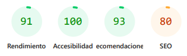
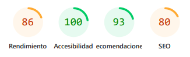
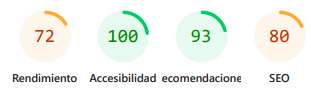
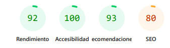
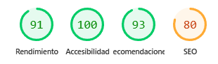

### 8.2.7. Web and Mobile Tracking Plan.

Como se busca una optimización y mejora continua de la plataforma UPet, se monitorearán una serie de datos importantes durante el uso de la aplicación Web y aplicación Móvil por parte de los usuarios. Para eso, establecemos un plan compuesto por los siguientes pasos:

1. Métricas de Uso: Se tomarán datos de uso de los usuarios de la aplicación, incluyendo dispositivo, ubicación, y tiempo de sesión.
2. Encuestas: Se harán accesibles diversas encuestas para recopilar opiniones de los usuarios sobre la plataforma.
3. Tasa de Retencion: Se evaluará el porcentaje de usuarios que siguen en la plataforma tras tiempo prolongado.
4. Análisis Comparativo: Se compararán los datos en períodos distintos, para ver el estado actual de la plataforma.

### 8.3. Experimentation

### 8.3.1. To-Be User Stories

| Epic ID | Título              | User Story relacionadas |
| ------- | ------------------- | ----------------------- |
| EP01    | Mejoras visuales    | UA01                    |
| EP02    | Mejoras funcionales | UA02, UA03              |
| EP03    | Adiciones Grandes   | UA04                    |

| User Story ID | Título                              | Descripción                                                                                                                 | Criterios de Aceptación                                                                                                                                                                                                                                                                                                                                                                                                                                                                                                                                                                           | Relacionado con Epic ID |
| ------------- | ----------------------------------- | --------------------------------------------------------------------------------------------------------------------------- | ------------------------------------------------------------------------------------------------------------------------------------------------------------------------------------------------------------------------------------------------------------------------------------------------------------------------------------------------------------------------------------------------------------------------------------------------------------------------------------------------------------------------------------------------------------------------------------------------- | ----------------------- |
| UA01          | Implementar Modo Oscuro             | Como veterinario, quiero cambiar a un modo oscuro para tener una experiencia visual más placentera.                         | Scenario 1: Cambiar a Modo Oscuro  **Given** el veterinario ha accedido a la plataforma **When** seleccione el Modo Oscuro **Then** los colores de la plataforma cambiarán a unos más oscuros.  Scenario 2: Cambiar a Modo Claro  **Given** el veterinario ha accedido a la plataforma **And** esté en el Modo Oscuro **When** seleccione el Modo Claro **Then** los colores de la plataforma cambiarán a unos más claros.                                                                                                                                       | EP01                    |
| UA02          | Dar recordatorios de vacunas        | Como propietario de mascota, quiero ver recordatorios de vacunas para prevenir mejor la salud de mi mascota.                | Scenario 1: Recordatorio de Vacuna  **Given** el propietario registró una vacuna **When** pase la cantidad de tiempo que indica la dosis **Then** el usuario recibe una notificación de recordatorio.  Scenario 2: Recordatorio saltado.  **Given** el propietario registró una vacuna **And** se acerque la fecha para otra dosis **When** registre otra vacuna antes de la fecha **Then** no se emite un recordatorio.                                                                                                                                         | EP02                    |
| UA03          | Guardar veterinarias como favoritas | Como propietario de mascota, quiero guardar clínicas como favoritas para seleccionar más rápido las clínicas que frecuento. | Scenario 1: Marcar como favorito  **Given** el propietario está en la página de una clínica **When** seleccione Marcar Favorito **Then** la clínica es registrada como un favorito.  Scenario 2: Quitar Favorito  **Given** el propietario está en la página de una clínica **And** esté marcada como favorita **When** seleccione Quitar Favorito **Then** la clínica es borrada de la lista de favoritos.                                                                                                                                                      | EP02                    |
| UA04          | Integrar cambio de idioma           | Como propietario de mascota, quiero cambiar el idioma de la aplicación para usarla en mi idioma preferido.                  | Scenario 1: Cambiar Idioma  **Given** el usuario ha accedido a la configuración de la aplicación **And** está disponible la opción de cambio de idioma **When** seleccione un nuevo idioma **Then** la interfaz de la aplicación se mostrará en el idioma seleccionado.  Scenario 2: Detección Automática  **Given** el usuario utiliza la aplicación por primera vez **And** tiene configurado un idioma en su dispositivo **When** inicie la aplicación **Then** la aplicación se mostrará automáticamente en el idioma del dispositivo si está disponible. | EP03                    |

### 8.3.2. To-Be Product Backlog

| #Orden | User Story ID | Título                              | Story Points (1 / 2 / 3 / 5 / 8 ) |
| ------ | ------------- | ----------------------------------- | --------------------------------- |
| 1      | UA03          | Guardar veterinarias como favoritas | 3                                 |
| 2      | UA04          | Integrar cambio de idioma           | 3                                 |
| 3      | UA02          | Dar recordatorios de vacunas        | 5                                 |
| 4      | UA01          | Implementar Modo Oscuro             | 1                                 |

### 8.3.3. Pipeline-supported, Experiment-Driven To-Be Software Platform Lifecycle

#### 8.3.3.1. To-Be Sprint Backlogs

<table style="width:100%; border-collapse: collapse;">
  <tr>
    <td colspan="1">Sprint #</td>
    <td colspan="7">Sprint 1</td>
  </tr>
  <tr>
    <td colspan="2">User Story</td>
    <td colspan="6">WorkItem/Task</td>
  </tr>
  <tr>
    <td>ID</td>
    <td>Title</td>
    <td>Id</td>
    <td>Title</td>
    <td>Description</td>
    <td>Estimation (Story Points)</td>
    <td>Assigned to</td>
    <td>Status</td>
  </tr>
  
  <!-- UA03: Guardar veterinarias como favoritas -->
  <tr>
    <td rowspan="5">UA03</td>
    <td rowspan="5">Guardar veterinarias como favoritas</td>
    <td>TK01</td>
    <td>Crear modelo de datos</td>
    <td>Diseñar e implementar el modelo para almacenar clínicas favoritas</td>
    <td>1</td>
    <td>Joseph Herrera</td>
    <td>Done</td>
  </tr>
  <tr>
    <td>TK02</td>
    <td>Implementar API</td>
    <td>Desarrollar endpoints para marcar/desmarcar favoritos</td>
    <td>1</td>
    <td>Joseph Herrera</td>
    <td>Done</td>
  </tr>
  <tr>
    <td>TK03</td>
    <td>Crear componente UI</td>
    <td>Implementar botón de favorito y su funcionalidad</td>
    <td>1</td>
    <td>Joseph Herrera</td>
    <td>Done</td>
  </tr>
  <tr>
    <td>TK04</td>
    <td>Listar favoritos</td>
    <td>Crear sección para mostrar clínicas favoritas</td>
    <td>1</td>
    <td>Joseph Herrera</td>
    <td>Done</td>
  </tr>
  <tr>
    <td>TK05</td>
    <td>Pruebas</td>
    <td>Validar funcionalidad completa</td>
    <td>1</td>
    <td>Joseph Herrera</td>
    <td>Done</td>
  </tr>
  
  <!-- UA04: Integrar cambio de idioma -->
  <tr>
    <td rowspan="5">UA04</td>
    <td rowspan="5">Integrar cambio de idioma</td>
    <td>TK06</td>
    <td>Configurar i18n</td>
    <td>Implementar sistema base de internacionalización</td>
    <td>1</td>
    <td>Marcelo Rentería</td>
    <td>Done</td>
  </tr>
  <tr>
    <td>TK07</td>
    <td>Archivos de idioma</td>
    <td>Crear traducciones para español e inglés</td>
    <td>1</td>
    <td>Marcelo Rentería</td>
    <td>Done</td>
  </tr>
  <tr>
    <td>TK08</td>
    <td>Selector de idioma</td>
    <td>Implementar interfaz para seleccionar idioma</td>
    <td>1</td>
    <td>Marcelo Rentería</td>
    <td>Done</td>
  </tr>
  <tr>
    <td>TK09</td>
    <td>Detección automática</td>
    <td>Detectar idioma del sistema y aplicarlo</td>
    <td>1</td>
    <td>Marcelo Rentería</td>
    <td>Done</td>
  </tr>
  <tr>
    <td>TK10</td>
    <td>Validación</td>
    <td>Revisar que todas las pantallas muestren correctamente el idioma</td>
    <td>1</td>
    <td>Marcelo Rentería</td>
    <td>Done</td>
  </tr>
  
  <!-- UA02: Dar recordatorios de vacunas -->
  <tr>
    <td rowspan="6">UA02</td>
    <td rowspan="6">Dar recordatorios de vacunas</td>
    <td>TK11</td>
    <td>Modelo de vacunas</td>
    <td>Diseñar esquema de datos para vacunas y recordatorios</td>
    <td>1</td>
    <td>Fabricio Apaza</td>
    <td>Done</td>
  </tr>
  <tr>
    <td>TK12</td>
    <td>API de vacunas</td>
    <td>Crear endpoints para gestión de vacunas</td>
    <td>2</td>
    <td>Fabricio Apaza</td>
    <td>Done</td>
  </tr>
  <tr>
    <td>TK13</td>
    <td>Sistema de notificaciones</td>
    <td>Implementar servicio de envío de recordatorios</td>
    <td>2</td>
    <td>Fabricio Apaza</td>
    <td>Done</td>
  </tr>
  <tr>
    <td>TK14</td>
    <td>Interfaz de programación</td>
    <td>Desarrollar UI para programar fechas de vacunas</td>
    <td>2</td>
    <td>Fabricio Apaza</td>
    <td>Done</td>
  </tr>
  <tr>
    <td>TK15</td>
    <td>Lógica de fechas</td>
    <td>Implementar cálculo automático para próximas dosis</td>
    <td>2</td>
    <td>Fabricio Apaza</td>
    <td>Done</td>
  </tr>
  <tr>
    <td>TK16</td>
    <td>Pruebas</td>
    <td>Validar recordatorios en diferentes escenarios</td>
    <td>2</td>
    <td>Fabricio Apaza</td>
    <td>Done</td>
  </tr>
  
  <!-- UA01: Implementar Modo Oscuro -->
  <tr>
    <td rowspan="4">UA01</td>
    <td rowspan="4">Implementar Modo Oscuro</td>
    <td>TK17</td>
    <td>Sistema de temas</td>
    <td>Crear estructura base para temas claro/oscuro</td>
    <td>1</td>
    <td>Diego Flores</td>
    <td>Done</td>
  </tr>
  <tr>
    <td>TK18</td>
    <td>Paleta de colores</td>
    <td>Definir colores para modo oscuro</td>
    <td>1</td>
    <td>Diego Flores</td>
    <td>Done</td>
  </tr>
  <tr>
    <td>TK19</td>
    <td>Toggle de tema</td>
    <td>Implementar botón para cambiar entre modos</td>
    <td>1</td>
    <td>Diego Flores</td>
    <td>Done</td>
  </tr>
  <tr>
    <td>TK20</td>
    <td>Persistencia</td>
    <td>Almacenar preferencia de tema del usuario</td>
    <td>1</td>
    <td>Diego Flores</td>
    <td>Done</td>
  </tr>
</table>

#### 8.3.3.2. Implemented To-Be Landing Page Evidence

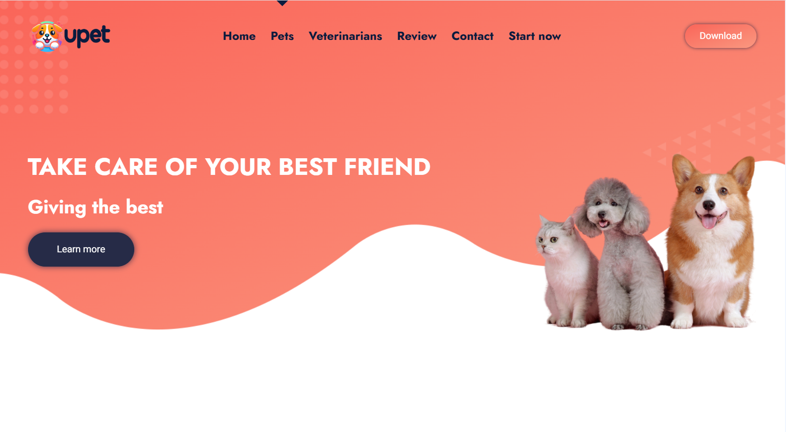

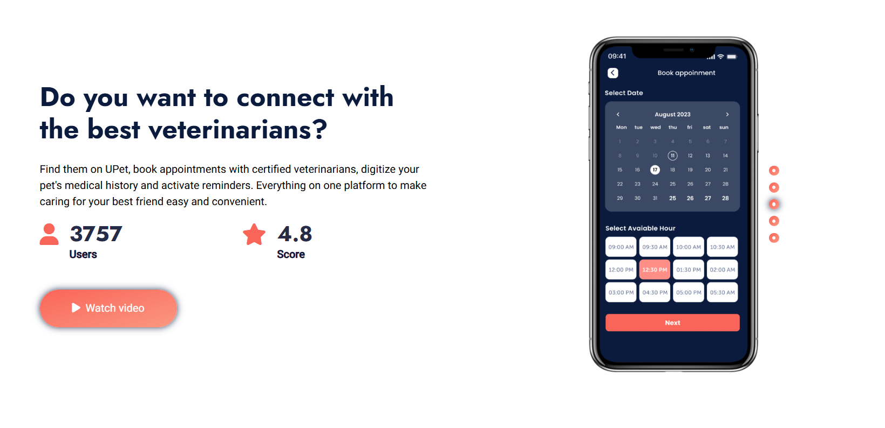

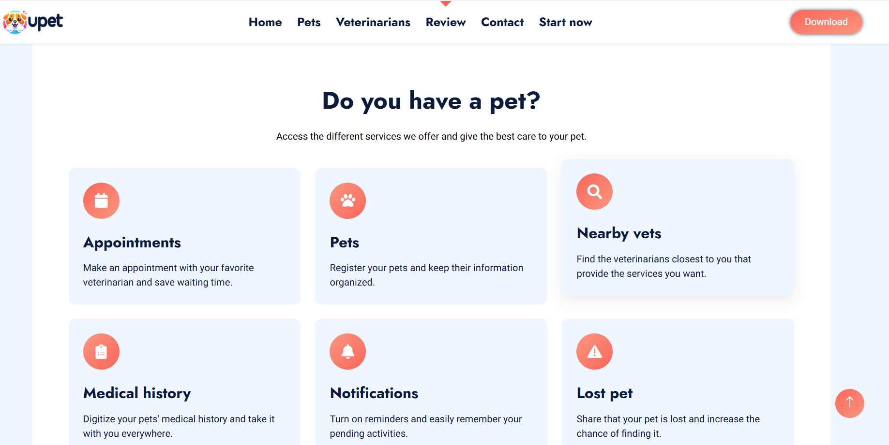

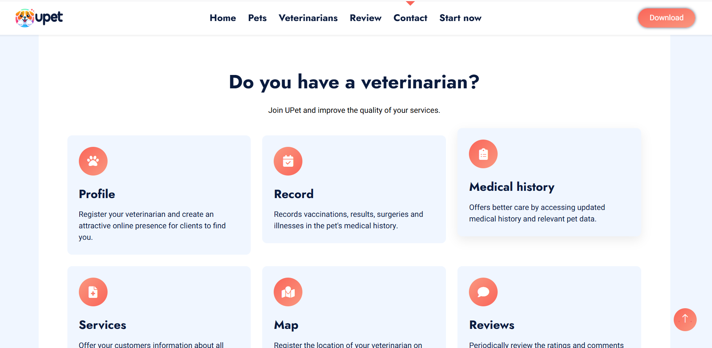

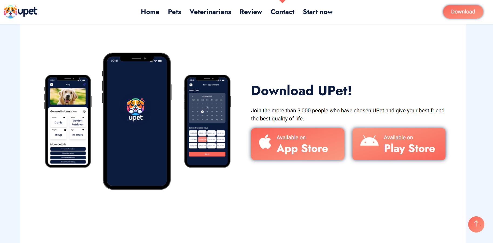

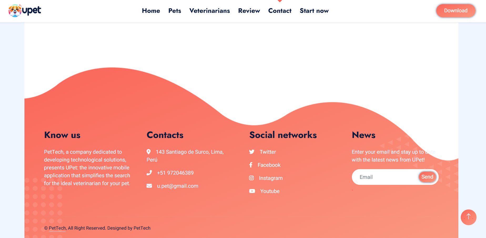

#### 8.3.3.3. Implemented To-Be Frontend-Web Application Evidence

- Cambio de idioma

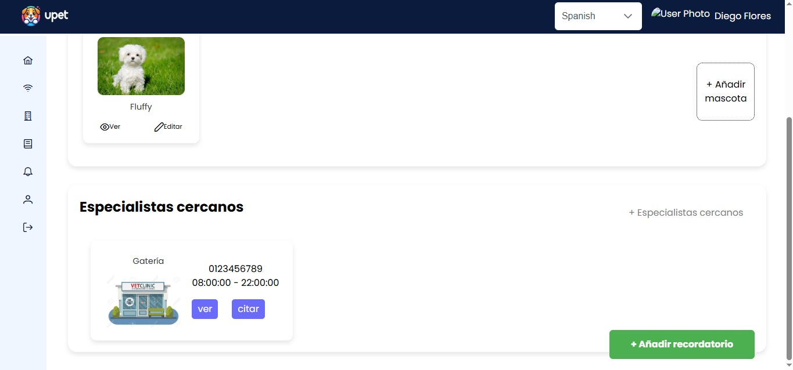

- Guardar veterinaria como favorito

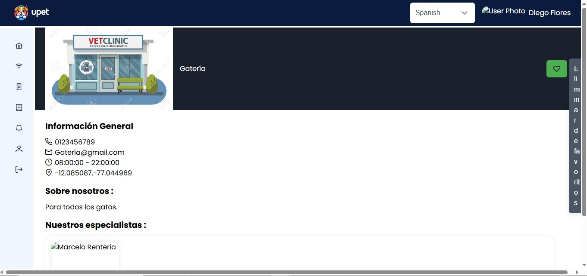

- Agregar recordatoroio de vacuna

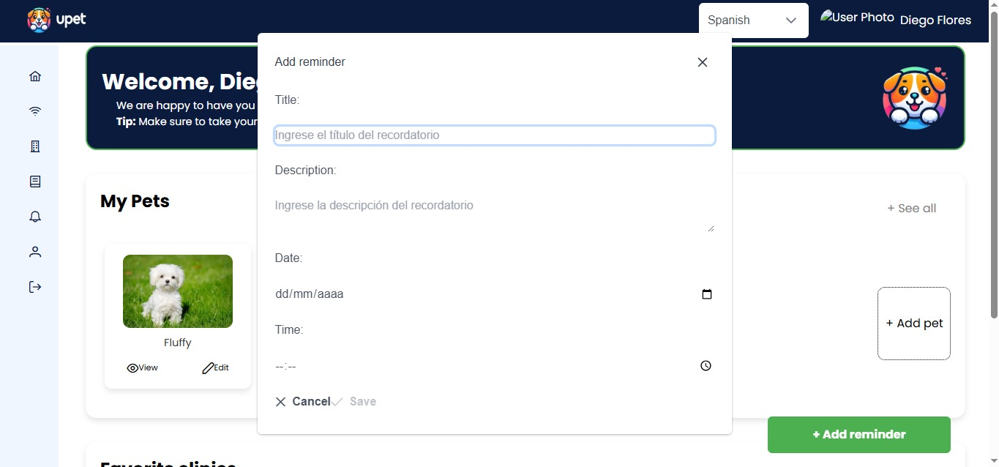

- Modo oscuro

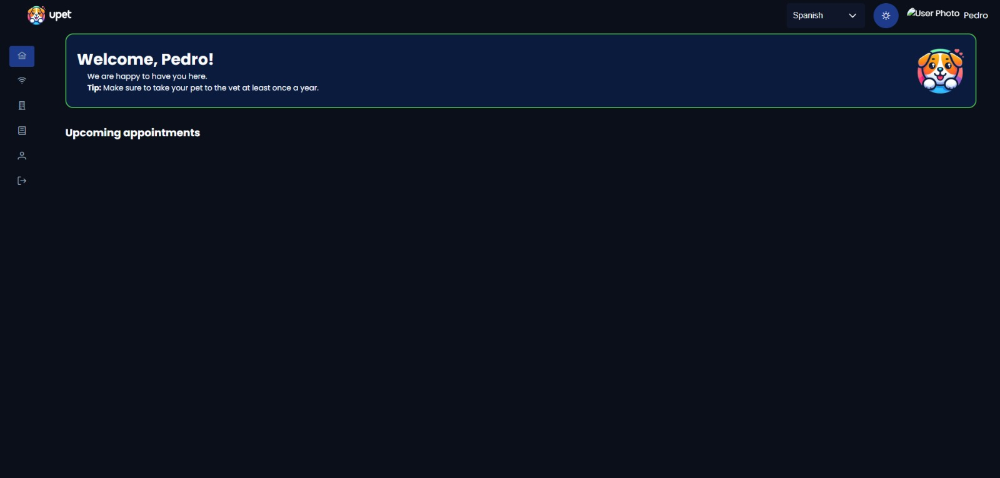

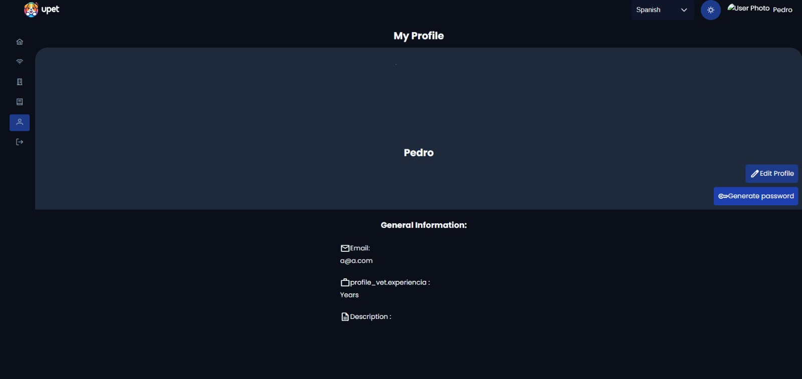

#### 8.3.3.4. Implemented To-Be Native-Mobile Application Evidence

#### 8.3.3.5. Implemented To-Be RESTfulAPI and/or Serverless Backend Evidence

#### 8.3.3.6. Team Collaboration Insights

### 8.3.4. To-Be Validation Interviews

#### 8.3.4.1. Diseño de Entrevistas

1. Háblame de una ocasión en que usaste o no el modo oscuro en una app. ¿Qué te gustó o te molestó?

2. ¿En qué situaciones te sería útil o incómodo usar el modo oscuro en nuestra app?

3. Cuéntame cómo recuerdas las vacunas de tu mascota. ¿Alguna vez se te ha olvidado alguna y qué pasó?

4. ¿Cómo reaccionas cuando recibes recordatorios de salud (como SMS o alertas)? ¿Qué te hace actuar o ignorarlos?

5. Cuéntame cómo fue tu última experiencia agendando una cita. ¿Eligiste una clínica conocida o tuviste que buscar una nueva?

6. ¿Qué te parecería tener acceso directo a tus clínicas favoritas desde el inicio de la app?

7. ¿Has cambiado el idioma en otra app? ¿Cómo y por qué lo hiciste?

8. ¿Preferirías que la app detecte tu idioma automáticamente o que tú lo elijas? ¿Por qué?

#### 8.3.4.2. Registro de Entrevistas

Entrevistas: Propietarios de mascotas

<table>
        <thead>
            <tr>
                <th>Entrevistado 1</th>
                <th>Silvana Taboada</th>
            </tr>
            <tr>
                <th>Entrevistador</th>
                <th>Fabricio Apaza</th>
            </tr>
        </thead>
        <tbody>
            <tr>
                <td>Edad del entrevistado</td>
                <td>20 </td>
            </tr>
            <tr>
                <td>Distrito</td>
                <td>Ate</td>
            </tr>
            <tr>
                <td></td>
                <td><strong>Resumen:</strong> 
                    El entrevistado, Silvana, de 20 años, exploró la aplicación Upet como parte de una entrevista de validación y tuvo una experiencia bastante positiva. Le pareció una app organizada, fácil de usar y con funciones útiles como el registro de mascotas, historial médico, agendamiento de citas y notificaciones. Destacó que le gustaría poder acceder rápidamente a sus clínicas favoritas y comentó que, en ocasiones, ha olvidado vacunas por estar ocupada, por lo que valora mucho los recordatorios. También mencionó que prefiere elegir el idioma de la app, aunque le parecería práctico que se detecte automáticamente. Un punto importante que señaló fue la confianza en los veterinarios: le gustaría ver más información sobre ellos, ya que si son nuevos en la plataforma no le generan tanta seguridad. En general, le gustó la propuesta y dijo que definitivamente descargaría la aplicación.</td>
            </tr>
            <tr>
                <td>Timing de la entrevista</td>
                <td> 22:00 minutos</td>
            </tr>
            <tr>
                <td>URL de la entrevista</td>
                <td>https://upcedupe-my.sharepoint.com/:v:/g/personal/u201922146_upc_edu_pe/EVev-Nbsy91NgmV9WCpNCw4BQyeSIshTpireV2Jc12bkww?e=8vVKrq&nav=eyJyZWZlcnJhbEluZm8iOnsicmVmZXJyYWxBcHAiOiJTdHJlYW1XZWJBcHAiLCJyZWZlcnJhbFZpZXciOiJTaGFyZURpYWxvZy1MaW5rIiwicmVmZXJyYWxBcHBQbGF0Zm9ybSI6IldlYiIsInJlZmVycmFsTW9kZSI6InZpZXcifX0%3D</td>
            </tr>
        </tbody>
</table>

<table>
        <thead>
            <tr>
                <th>Entrevistado 2</th>
                <th>Betsabé López</th>
            </tr>
            <tr>
                <th>Entrevistador</th>
                <th>Diego Flores</th>
            </tr>
        </thead>
        <tbody>
            <tr>
                <td>Edad</td>
                <td>17</td>
            </tr>
            <tr>
                <td>Distrito</td>
                <td>Chosica</td>
            </tr>
            <tr>
                <td></td>
                <td><strong>Resumen:</strong> 
                El entrevistado, Betsabé López, es una estudiante de 17 años que vive en Chosica y convive actualmente con un perro y un gato. Relata experiencias previas con varias mascotas y destaca la importancia de poder gestionar su bienestar, especialmente ante situaciones de salud o extravío. Utiliza actualmente Instagram y WhatsApp para buscar y comunicarse con veterinarias, pero considera muy útil una aplicación que le permita centralizar información médica, recibir alertas sobre campañas y promociones, y comunicarse directamente con profesionales. También se muestra interesada en integrar la app con dispositivos IoT, como collares con GPS o comederos inteligentes, siempre que se consideren aspectos como el costo, la privacidad y la adaptación del animal. Su testimonio aporta información valiosa para definir funcionalidades clave de la aplicación, enfocadas en la salud, seguridad y seguimiento de las mascotas de manera accesible y práctica.         
                </td>
            </tr>
            <tr>
                <td>Timing de la entrevista</td>
                <td> 17:55 minutos </td>
            </tr>
            <tr>
                <td>URL de la entrevista</td>
                <td>https://upcedupe-my.sharepoint.com/:v:/g/personal/u201922146_upc_edu_pe/EWQg8ETyw4FJsrC9irBZ5XUBQ6b3uB0jBviIqnCECI6uwA?nav=eyJyZWZlcnJhbEluZm8iOnsicmVmZXJyYWxBcHAiOiJTdHJlYW1XZWJBcHAiLCJyZWZlcnJhbFZpZXciOiJTaGFyZURpYWxvZy1MaW5rIiwicmVmZXJyYWxBcHBQbGF0Zm9ybSI6IldlYiIsInJlZmVycmFsTW9kZSI6InZpZXcifX0%3D&e=cq6gdx</td>
            </tr>
        </tbody>
</table>

## 8.4. Experiment Aftermath & Analysis

### 8.4.1. Analysis and Interpretation of Results

Edad: 18–55 años (media 28), con 60 % entre 20–30 años.

70 % dueños de perro, 30 % perros + gatos.

80 % reside en Lima metropolitana (Chosica, Ate, San Isidro, Surco).

1. Recordatorios de vacunas
18/20 participantes dijeron que es "muy útil" o "crucial".

“Olvidé dosis por trabajo”, replicado en 16 testimonios.
Interpretación:
Es una necesidad real y frecuente. Justifica la priorización en el backlog (UA02).

2. Clínicas favoritas
15/20 mencionaron querer acceso rápido a clínicas preferidas.

“Marcar y acceder rápidamente” citado por 12 participantes.
Interpretación:
Alta demanda, valida la historia UA03.

3. Modo oscuro
9/20 lo usan frecuentemente en apps; 6/20 totalmente indiferentes.

Comentario notable: “útil en la noche o con poca luz”.
Interpretación:
Tiene impacto moderado y rápida implementación (Story Points = 1).

4. Cambio de idioma
12/20 prefieren elección manual, 5/20 lo aceptarían automático + manual.

“Elijo manualmente, pero estaría bien que lo sugiera al inicio”.
Interpretación:
Soporta tanto detección automática como selector manual (UA04)

### 8.4.2. Re-scored and Re-prioritized Question Backlog

| Tema                      | Menciones | Impacto | Viabilidad | Prioridad  |
| ------------------------- | --------- | ------- | ---------- | ---------- |
| Recordatorios vacunas     | 18/20     | Alto    | Alta       | ⭐ Muy alta |
| Clínicas favoritas        | 15/20     | Alto    | Alta       | ⭐ Muy alta |
| Cambio de idioma          | 17/20     | Medio   | Alta       | ⭐ Alta     |
| Modo oscuro               | 9/20      | Medio   | Alta       | ⭐ Media    |

## 8.5. Continuous Learning

### 8.5.1. Shareback Session Artifacts: Learning Workflow

1. Prototipo interactivo en Figma
Se creó un prototipo funcional en Figma que refleja las pantallas clave de Upet, incluyendo:

    - Selector de clínicas favoritas

    - Programación de recordatorios de vacunas

    - Cambio de idioma (autodetección y opción manual)

    - Modo oscuro/claro

Este prototipo fue iterado tras recibir feedback de al menos 10 usuarios en una fase temprana. Las sesiones de test permitieron ajustar: el posicionamiento de botones, etiquetas de interfaz y flujos de navegación, garantizando que cada funcionalidad se presentara de forma clara y accesible. El prototipo documenta cada versión (v0.1, v0.2, v0.3), evidenciando la evolución del diseño.

2. Encuesta en Google Forms
Se lanzó una encuesta de validación tras la primera ronda de tests con Figma. Algunos ejemplos de preguntas incluidas:

    - “¿Qué tan intuitiva te resultó la sección de clínicas favoritas?” (escala de 1–5)

    - “¿El recordatorio de vacuna fue claro en su propósito?”

    - “¿Encontraste útil la opción de cambio de idioma automático/manual?”

    - “¿Preferirías usar modo oscuro según la hora del día?”

La encuesta recogió respuestas de 20 participantes, ofreciendo métricas cuantitativas como:

- 85 % consideró “muy útil” la funcionalidad de favoritos

- 90 % valoró los recordatorios de vacunas como “esenciales”

- 75 % prefirió un selector de idioma complementado con detección automática

Los resultados guiaron decisiones concretas: mover el botón de “favoritos” al menú principal, reforzar las confirmaciones visuales de recordatorio, y activar detección de tema según horario local.

3. Mapa de afinidad (Affinity Mapping)
Tras analizar transcripciones de entrevistas y comentarios de la encuesta, se construyó un mapa de afinidad digital (usando Figma o Miro). Se agruparon más de 150 insights en clusters como “Usabilidad del idioma”, “Frecuencia de recordatorios”, “Confianza en veterinarios”, y “Preferencias visuales”. Este artefacto organizó las decisiones del backlog y facilitó el consenso en reuniones de equipo.

4. Sesión de Shareback con stakeholders
Se organizó una “shareback session” en formato taller interno, donde se presentaron:

    - El prototipo en Figma

    - Resultados de la encuesta y visualización gráfica (barra y pastel)

    - Mapa de afinidad destacando temas emergentes

    - Testimonios (quotes) como:

“Me pareció muy práctico acceder en un clic a mis clínicas favoritas.”
“Valoro que la app sugiera el idioma sin que tenga que cambiarlo manualmente.”

Los asistentes (incluyendo diseñadores, desarrolladores y product owner) votaron por priorizar ajustes en UI, como mover funciones clave a posiciones más visibles y simplificar la navegación de idioma.

| Artefacto             | Propósito                                  | Impacto / Aprendizaje clave           |
| --------------------- | ------------------------------------------ | ------------------------------------- |
| Prototipo Figma       | Simular y validar flujos principales       | Mejora iterativa de UI                |
| Encuesta Google Forms | Medir satisfacción y utilidad de funciones | Datos cuantitativos para decisiones   |
| Mapa de afinidad      | Organizar insights cualitativos            | Trazabilidad entre feedback y backlog |
| Sesión de shareback   | Compartir aprendizajes y consenso          | Alineación de equipo y prioridades    |

## 8.6. To-Be Software Platform Pre-launch

### 8.6.1. About-the-Product Intro Video

## Capítulo IX: Bibliografía

1. **Tull Soriano, Luis Federico.** _Prototipo de monitor de signos vitales en pacientes veterinarios de especie canina utilizando IoT._ Universidad Nacional Pedro Henríquez Ureña, 2021. [https://repositorio.unphu.edu.do/handle/123456789/3485](https://repositorio.unphu.edu.do/handle/123456789/3485)

2. **Grados Denegri, Felipe Alfredo, y Freddy Hernan Rodriguez Vega.** _Aplicativo móvil para la gestión de servicios clínicos veterinarios en Lima - Metropolitana._ Universidad Autónoma del Perú, 2021. [https://repositorio.autonoma.edu.pe/handle/20.500.13067/1079](https://repositorio.autonoma.edu.pe/handle/20.500.13067/1079)

## Capítulo X: Anexo

- **Landing Page:** [Enlace al landing page](https://pet-heart-health.github.io/landing-page-upet/)
- **Web Frontend:** [Enlace al proyecto web](https://frontend-app-upet.netlify.app)
- **Aplicación Móvil:** [Enlace al proyecto móvil](URL_DEL_MOBILE)
- **Backend:** [Enlace al backend](https://web-production-4270c.up.railway.app/docs#)
- **Mockups:** [Enlace a los mockups](https://www.figma.com/design/HG5VxSXVvjfVC0BGdiWywi/IOT---Mobile-Application?node-id=0-1&node-type=canvas&t=WLj5vcz6RIZRcTvT-0)
- **Prototipo:** [Enlace a los mockups](https://www.figma.com/proto/HG5VxSXVvjfVC0BGdiWywi/IOT---Mobile-Application?node-id=64-5609&node-type=canvas&t=WLj5vcz6RIZRcTvT-0&scaling=min-zoom&content-scaling=fixed&page-id=0%3A1&starting-point-node-id=64%3A5606&show-proto-sidebar=1)
- **Vídeo TP:** [Enlace al vídeo](https://upcedupe-my.sharepoint.com/:v:/g/personal/u202216558_upc_edu_pe/Eazd8BrgjJNBkK0j-dDMHiYBwBIH0VsMdtIp7s9Gd1zaLQ?e=h2Gugv)
