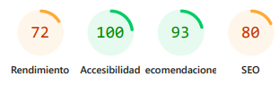

# Capítulo VIII: Experiment-Driven Development

## 8.1. Experiment Planning

### 8.1.1. As-Is Summary

La aplicación actual se centra en ofrecer una plataforma para facilitar el contacto de veterinarios para tratar sus mascotas, proporcionando funcionalidades básicas como la gestión de perfiles de usuarios, reportes médicos y datos de los animales, y un sistema de recordatorios para citas agendadas con el veterinario. Sin embargo, el rendimiento general es inconsistente, con la función de elección de ubicación funcionando irregularmente, y cambios no mostrándose hasta actualizar la página, lo que afecta la experiencia del usuario. La interfaz presenta limitaciones en términos de personalización, y no se adapta adecuadamente a diferentes condiciones de luz.

### 8.1.2. Raw Material: Assumptions, Knowledge Gaps, Ideas, Claims

**Assumptions:**

- _Modo Oscuro_: Se asume que los usuarios valoran que el diseño de la interfaz se acomode a sus preferencias visuales.

- _Olvido de vacunación_: Se asume que muchos dueños de mascotas olvidan las fechas de vacunación si no cuentan con recordatorios automáticos.

- _Clínicas veterinarias favoritas_: Se asume que los usuarios querrán guardar como favoritas las clínicas que ya conocen o en las que confían, para encontrarlas más rápido en el futuro.

- _Segmentación de perfil de mascota favorita_: Se asume que los usuarios querrán no solo guardar clínicas favoritas, sino también establecer perfiles completos incluyendo, fotos, información de raza, edad y métricas.

**Knowledge Gaps:**

- _Preferencias de Interfaz_: Falta información sobre las preferencias que tienen los usuarios respecto al diseño de la interfaz.

- _Frecuencia del olvido_: No se tiene información precisa sobre cuántos usuarios han olvidado citas o vacunas importantes para sus mascotas.

- _Frecuencia de citas en la misma clínica_: No se sabe cuántos usuarios repiten de clínica veterinaria en sus citas, ni si realmente necesitan una opción de “favoritos”

- _Integración con telemedicina o wearables_: Falta saber si los usuarios desean integrar información de dispositivos inteligentes (como collares con GPS o wearables de salud) o consultas remotas con veterinarios, y hasta qué punto esto influiría en su satisfacción y uso frecuente .

**Ideas:**

- _Entrevistas_: Realizar entrevistas a los usuarios, en los que preguntamos y recolectamos información sobre sus preferencias.

- _Funcionalidad de recordatorios_: Implementar una funcionalidad que envíe notificaciones automáticas antes de las fechas de vacunación, y medir su impacto con encuestas o métricas de cumplimiento.

- _Botón de guardar como favorita_: Agregar un botón de “guardar como favorita” en el perfil de cada clínica, y luego analizar cuántas veces es usado y con qué frecuencia se agenda con esas clínicas favoritas.

- _Dashboard de métricas visuales por mascota_: Implementar un panel donde se visualicen gráficas de peso, vacunaciones, medicaciones y recordatorios por cada mascota, según prefieren algunos usuarios para aplicaciones de cuidado de mascotas .

**Claims:**

- _Experiencia más cómoda_: Se afirma que el Modo Oscuro proporcionará una experiencia más cómoda a los usuarios.

- _Mejora de cumplimiento_: Se afirma que al incluir recordatorios automáticos de vacunación, se mejora la salud preventiva de las mascotas y se reduce el riesgo de enfermedades comunes.

- _Eficiencia al agendar citas_: Se afirma que permitir guardar veterinarias favoritas mejora la rapidez al agendar citas y refuerza el vínculo con clínicas confiables.

- _Mejora de la toma de decisiones preventivas_: Se afirma que al ofrecer gráficos y tendencias de salud por mascota (peso, vacunas, programaciones), los dueños estarán mejor informados y tomarán decisiones proactivas de salud (e.g., detectar aumento de peso o falta de vacunación).

### 8.1.3. Experiment-Ready Questions

| Question                                                                                                                                                                                                      | Confidence                                                                                                                                                                                                             | Risk                                                                                                                                      | Impact                                                                                                                                                                | Interest                                                                                                                                        | Total Score |
| ------------------------------------------------------------------------------------------------------------------------------------------------------------------------------------------------------------- | ---------------------------------------------------------------------------------------------------------------------------------------------------------------------------------------------------------------------- | ----------------------------------------------------------------------------------------------------------------------------------------- | --------------------------------------------------------------------------------------------------------------------------------------------------------------------- | ----------------------------------------------------------------------------------------------------------------------------------------------- | ----------- |
| ¿Un Modo Oscuro mejoraría la experiencia?                                                                                                                                                                     | 8 - Varias aplicaciones lo tienen, y el porcentaje de uso es notable.                                                                                                                                                  | 2 - Bajo riesgo, ya que es una funcionalidad sencilla de colores                                                                          | 5 - Mejora la experiencia, pero no es esencial.                                                                                                                       | 5 - Interés moderado en los usuarios.                                                                                                           | 20          |
| ¿La implementación de recordatorios de vacunación aumentará el cumplimiento del calendario de salud de las mascotas?                                                                                          | 7 – Es una práctica común en apps de salud y organización, pero no tenemos datos específicos de nuestros usuarios aún.                                                                                                 | 3 – Riesgo bajo-moderado: requiere integración con historial médico y sistema de notificaciones.                                          | 8 – Tiene alto impacto en la salud de las mascotas y fidelización de usuarios.                                                                                        | 7 – Alta probabilidad de interés: dueños responsables valoran el cuidado preventivo.                                                            | 25          |
| ¿Permitir guardar veterinarias como favoritas mejora la rapidez para agendar y refuerza la relación con clínicas conocidas?                                                                                   | 7 – Varias plataformas similares permiten guardar elementos favoritos; es una práctica común                                                                                                                           | 2 – Bajo riesgo técnico, ya que no modifica el código existente                                                                           | 5 – Mejora la experiencia, pero no es una funcionalidad crítica.                                                                                                      | 6 – Probable interés entre usuarios frecuentes o con clínicas de preferencia.                                                                   | 20          |
| ¿La integración de datos de wearables (actividad, ritmo cardíaco, ubicación) y/o consultas remotas con veterinarios mejora la detección temprana de problemas de salud y el vínculo usuario-app-veterinarios? | 6 – El uso de wearables en mascotas está creciendo (más del 30 % de adopción en EE. UU.; 65 % de veterinarios ven valor en la detección temprana) . Además, la telemedicina veterinaria ya es una práctica establecida | 4 – Requiere integración con sensores externos, validación de datos y configuración de canales remotos; implica nivel técnico medio‑alto. | 9 – Alta relevancia: permite detección precoz de enfermedades, reduce visitas innecesarias al veterinario y mejora la fidelización al ofrecer previsión y autonomía . | 8 – Los usuarios cada vez están más interesados en herramientas tecnológicas que les aporten control y tranquilidad (GPS, salud, teleconsultas) | 27          |                                 

### 8.1.4. Question Backlog

| Prioridad | Pregunta                                                                                                                    |
| --------- | --------------------------------------------------------------------------------------------------------------------------- |
| 1         | ¿Un Modo Oscuro mejoraría la experiencia?                                                                                   |
| 2         | ¿Los recordatorios ayudarán a que los dueños de mascotas cumplan a tiempo con las vacunas?                                  |
| 3         | ¿Permitir guardar veterinarias como favoritas mejora la rapidez para agendar y refuerza la relación con clínicas conocidas? |
| 3         | ¿La integración de datos de wearables (actividad, ritmo cardíaco, ubicación) y/o consultas remotas con veterinarios mejora la detección temprana de problemas de salud y el vínculo usuario-app-veterinarios? |                                                                                                                         |

### 8.1.5. Experiment Cards

| Question   | ¿Un Modo Oscuro mejoraría la experiencia?                                                                                                                               |
| ---------- | ----------------------------------------------------------------------------------------------------------------------------------------------------------------------- |
| Why        | Al agregar un modo oscuro, la visibilidad y comodidad de la interfaz sería mayor para los usuarios que prefieran estos colores, especialmente en ambientes de luz baja. |
| What       | Implementar un botón que cambie entre ambos modos de color.                                                                                                             |
| Hypothesis | Se espera que, al añadir el modo oscuro, el tiempo de uso de la aplicación por parte del 50% de los usuarios aumente en un 30%.                                         |

| Question   | ¿Los recordatorios ayudarán a que los dueños de mascotas cumplan a tiempo con las vacunas?  |
| ---------- | ------------------------------------------------------------------------------------------- |
| Why        | Porque muchos usuarios no llevan un control estricto del calendario de vacunación de sus mascotas, lo que puede afectar su salud. Un recordatorio automático podría ayudarles a no olvidar fechas importantes. |
| What       | Implementar una funcionalidad que permita registrar fechas de vacunación y enviar notificaciones previas al usuario (por ejemplo, 3 días antes, 1 día antes y el mismo día).                                   |
| Hypothesis | Se espera que, con los recordatorios activos, al menos el 60% de los usuarios registrados con mascotas vacunadas cumplan sus citas a tiempo durante el primer mes.                                             |

| Question   | ¿Permitir guardar veterinarias como favoritas mejora la rapidez para agendar y refuerza la relación con clínicas conocidas?                                                    |
| ---------- | ------------------------------------------------------------------------------------------------------------------------------------------------------------------------------ |
| Why        | Porque al permitir que los usuarios marquen como favoritas las clínicas de su confianza, se facilitará el acceso a ellas, promoviendo agendamientos más rápidos y recurrentes. |
| What       | Habilitar un botón con ícono de estrella en el perfil de cada clínica para marcarla como favorita y mostrar una sección especial con acceso rápido en el inicio de la app.     |
| Hypothesis | Se espera que al menos el 40% de los usuarios que marquen una veterinaria como favorita agenden su siguiente cita con esa misma clínica en un plazo de 30 días.                |

| Question   | ¿La integración de datos de wearables (actividad, ritmo cardíaco, ubicación) y/o consultas remotas con veterinarios mejora la detección temprana de problemas de salud y el vínculo usuario-app-veterinarios?                                                                                                                               |
| ---------- | ----------------------------------------------------------------------------------------------------------------------------------------------------------------------- |
| Why        | Al integrar datos de wearables, la detección temprana de problemas de salud sería más fácil para los dueños de mascotas. |
| What       | Implementar integración IoT entre la plataforma y un dispositivo físico para las mascotas.                                                                                                             |
| Hypothesis | Se espera que, al integrar datos de wearables, el número de citas con veterinarios aumente en un 20% al mes.                                         |

# 8.2. Experiment Design

### 8.2.1. Experiment Cards

|                 | Hypothesis                                                                                                                                                              |
| --------------- | ----------------------------------------------------------------------------------------------------------------------------------------------------------------------- |
| Question        | ¿Un Modo Oscuro mejoraría la experiencia?                                                                                                                               |
| Belief          | Al agregar un modo oscuro, la visibilidad y comodidad de la interfaz sería mayor para los usuarios que prefieran estos colores, especialmente en ambientes de luz baja. |
| Hypothesis      | Se espera que, al añadir el modo oscuro, el tiempo de uso de la aplicación por parte del 50% de los usuarios aumente en un 30%.                                         |
| Null Hypothesis | Al añadir el modo oscuro, el tiempo de uso de la aplicación por parte del 50% de los usuarios no se verá afectada en gran medida.                                       |

|                 | Hypothesis                                                                                                                                                                              |
| --------------- | --------------------------------------------------------------------------------------------------------------------------------------------------------------------------------------- |
| Question        | ¿Los recordatorios automáticos ayudarán a que los dueños de mascotas cumplan a tiempo con las vacunas?                                                                                  |
| Belief          | Muchos usuarios olvidan las fechas de vacunación de sus mascotas. Al ofrecer recordatorios automáticos, facilitamos el cumplimiento del calendario de salud preventiva.                 |
| Hypothesis      | Se espera que, al implementar los recordatorios, al menos el 60% de los usuarios con mascotas registradas completen sus vacunas programadas en la fecha estimada durante el primer mes. |
| Null Hypothesis | La implementación de recordatorios no generará un cambio significativo en el cumplimiento de las fechas de vacunación programadas por los usuarios.                                     |

|                 | Hypothesis                                                                                                                                                                                |
| --------------- | ----------------------------------------------------------------------------------------------------------------------------------------------------------------------------------------- |
| Question        | ¿Permitir guardar veterinarias como favoritas mejora la rapidez para agendar y refuerza la relación con clínicas conocidas?                                                               |
| Belief          | Al permitir que los usuarios marquen veterinarias como favoritas, se reducirá el tiempo que tardan en buscarlas y aumentará la probabilidad de que repitan citas en esas mismas clínicas. |
| Hypothesis      | Se espera que al menos el 40% de los usuarios que marquen una veterinaria como favorita agenden su siguiente cita con esa misma clínica en un plazo de 30 días.                           |
| Null Hypothesis | La opción de guardar veterinarias favoritas no influirá significativamente en la elección de clínica ni en el tiempo que toma agendar una cita.                                           |

|                 | Hypothesis                                                                                                                                                              |
| --------------- | ----------------------------------------------------------------------------------------------------------------------------------------------------------------------- |
| Question        | ¿La integración de datos de wearables (actividad, ritmo cardíaco, ubicación) y/o consultas remotas con veterinarios mejora la detección temprana de problemas de salud y el vínculo usuario-app-veterinarios?                                                                                                                               |
| Belief          | Al integrar datos de wearables, la detección temprana de problemas de salud sería más fácil para los dueños de mascotas. |
| Hypothesis      | Se espera que, al integrar datos de wearables, el número de citas con veterinarios aumente en un 20% al mes.                                          |
| Null Hypothesis | Al integrar datos de wearables, el número de citas con veterinarios no aumentará en gran medida.                                       |

### 8.2.2. Measures

| Question | ¿Un Modo Oscuro mejoraría la experiencia?                                                                                                                                                  |
| -------- | ------------------------------------------------------------------------------------------------------------------------------------------------------------------------------------------ |
| Measure  | Medir el tiempo de uso de los usuarios, registrando los tiempos de inicio de sesión, y su cierre correspondiente. Sacando un promedio de la mitad de los usuarios, se evaluará su impacto. |

| Question | ¿Los recordatorios automáticos ayudarán a que los dueños de mascotas cumplan a tiempo con las vacunas?                                                                                                                                         |
| -------- | ---------------------------------------------------------------------------------------------------------------------------------------------------------------------------------------------------------------------------------------------- |
| Measure  | Medir la cantidad de vacunas registradas como "cumplidas a tiempo", comparando el comportamiento de los usuarios antes y después de habilitar los recordatorios. También se pueden usar encuestas de percepción sobre la utilidad del sistema. |

| Question | ¿Permitir guardar veterinarias como favoritas mejora la rapidez para agendar y refuerza la relación con clínicas conocidas?                                                                                                                     |
| -------- | ----------------------------------------------------------------------------------------------------------------------------------------------------------------------------------------------------------------------------------------------- |
| Measure  | Medir la frecuencia con la que los usuarios agendan citas con clínicas marcadas como favoritas y el tiempo promedio que tardan en agendar una cita desde que ingresan a la app. Comparar esto con usuarios que no usan la función de favoritos. |

| Question | ¿La integración de datos de wearables (actividad, ritmo cardíaco, ubicación) y/o consultas remotas con veterinarios mejora la detección temprana de problemas de salud y el vínculo usuario-app-veterinarios?                                                                                                                     |
| -------- | ----------------------------------------------------------------------------------------------------------------------------------------------------------------------------------------------------------------------------------------------- |
| Measure  | Medir la frecuencia con la que los usuarios en promedio agendan citas con clínicas veterinarias, tras la integración de los datos con wearables. |

### 8.2.3. Conditions

| Question               | ¿Un Modo Oscuro mejoraría la experiencia?                                               |
| ---------------------- | --------------------------------------------------------------------------------------- |
| Condición Experimental | El tiempo de uso aumentará en un 30%, medido a través de registros de tiempo de sesión. |
| Condición de Control   | No habrá un aumento significativo del tiempo de uso por parte de los usuarios.          |

| Question               | ¿Los recordatorios automáticos ayudarán a que los dueños de mascotas cumplan a tiempo con las vacunas de sus animales?                           |
| ---------------------- | ------------------------------------------------------------------------------------------------------------------------------------------------ |
| Condición Experimental | El porcentaje de cumplimiento de vacunas a tiempo será igual o mayor al 60% entre los usuarios que recibieron recordatorios.                     |
| Condición de Control   | El porcentaje de cumplimiento de vacunas a tiempo se mantendrá igual o por debajo del comportamiento base (< 40%) en usuarios sin recordatorios. |

| Question               | ¿Permitir guardar veterinarias como favoritas mejora la rapidez para agendar y refuerza la relación con clínicas conocidas?                          |
| ---------------------- | ---------------------------------------------------------------------------------------------------------------------------------------------------- |
| Condición Experimental | Al menos el 40% de los usuarios que guardaron una veterinaria como favorita agendarán su siguiente cita con la misma clínica en un plazo de 30 días. |
| Condición de Control   | No habrá una diferencia significativa en la elección de clínicas entre los usuarios que usan favoritos y los que no.                                 |

| Question               | ¿La integración de datos de wearables (actividad, ritmo cardíaco, ubicación) y/o consultas remotas con veterinarios mejora la detección temprana de problemas de salud y el vínculo usuario-app-veterinarios?                          |
| ---------------------- | ---------------------------------------------------------------------------------------------------------------------------------------------------- |
| Condición Experimental | Al menos en 20% aumentará la cantidad promedio de citas agendadas al mes. |
| Condición de Control   | No habrá una diferencia significativa en la cantidad de citas agendadas al mes.                                 |

### 8.2.4. Scale Calculations and Decisions.

<table>
  <tr>
    <td rowspan="2"><strong>Scale Calculation</strong></td>
    <td rowspan="2"><strong>Decision</strong></td>
    <td colspan="4"><strong>Factor</strong></td>
  </tr>
  <tr>
    <td>Desfavorable</td>
    <td>Aceptable</td>
    <td>Ideal</td>
    <td>Excelente</td>
  </tr>
  <tr>
    <td>Creemos que, al añadir recordatorios para vacunas, los dueños de mascotas cumplirán a tiempo con las vacunas de sus animales. Sabremos que esto es cierto cuando el porcentaje de cumplimiento de vacunas a tiempo será igual o mayor al 60% entre los usuarios que recibieron recordatorios.</td>
    <td>Implementaremos un botón en el menú lateral de la aplicación que, al presionarse, intercambiaré entre modos de color.</td>
    <td></td>
    <td></td>
    <td>X</td>
    <td></td>
  </tr>
</table>

<table>
  <tr>
    <td rowspan="2"><strong>Scale Calculation</strong></td>
    <td rowspan="2"><strong>Decision</strong></td>
    <td colspan="4"><strong>Factor</strong></td>
  </tr>
  <tr>
    <td>Desfavorable</td>
    <td>Aceptable</td>
    <td>Ideal</td>
    <td>Excelente</td>
  </tr>
  <tr>
    <td>Creemos que, al permitir guardar veterinarias como favoritas, los usuarios agendarán con mayor rapidez y frecuencia con clínicas conocidas. Sabremos que esto es cierto cuando al menos el 40% de los usuarios que usen esta función reserven su siguiente cita con una clínica favorita en los próximos 30 días.</td>
    <td>Se habilitará un botón con ícono de estrella en el perfil de cada clínica veterinaria para marcarla como favorita y se mostrará una sección de acceso rápido a esas clínicas en el inicio de la app.</td>
    <td></td>
    <td></td>
    <td></td>
    <td>X</td>
  </tr>
</table>

<table>
  <tr>
    <td rowspan="2"><strong>Scale Calculation</strong></td>
    <td rowspan="2"><strong>Decision</strong></td>
    <td colspan="4"><strong>Factor</strong></td>
  </tr>
  <tr>
    <td>Desfavorable</td>
    <td>Aceptable</td>
    <td>Ideal</td>
    <td>Excelente</td>
  </tr>
  <tr>
    <td>Creemos que, al permitir guardar veterinarias como favoritas, los usuarios agendarán con mayor rapidez y frecuencia con clínicas conocidas. Sabremos que esto es cierto cuando al menos el 40% de los usuarios que usen esta función reserven su siguiente cita con una clínica favorita en los próximos 30 días.</td>
    <td>Se habilitará un botón con ícono de estrella en el perfil de cada clínica veterinaria para marcarla como favorita y se mostrará una sección de acceso rápido a esas clínicas en el inicio de la app.</td>
    <td></td>
    <td></td>
    <td></td>
    <td>X</td>
  </tr>
</table>

<table>
  <tr>
    <td rowspan="2"><strong>Scale Calculation</strong></td>
    <td rowspan="2"><strong>Decision</strong></td>
    <td colspan="4"><strong>Factor</strong></td>
  </tr>
  <tr>
    <td>Desfavorable</td>
    <td>Aceptable</td>
    <td>Ideal</td>
    <td>Excelente</td>
  </tr>
  <tr>
    <td>Creemos que, al integrar datos de wearables, la detección temprana de problemas de salud sería más fácil para los dueños de mascotas. Sabremos que esto es cierto cuando la cantidad promedio de citas agendadas al mes aumente en al menos un 20% tras la integración de datos con wearables.</td>
    <td>Implementar integración IoT entre la plataforma y un dispositivo físico para las mascotas.</td>
    <td></td>
    <td></td>
    <td>X</td>
    <td></td>
  </tr>
</table>

### 8.2.5. Methods Selection.

| Herramienta      | Google Analytics                                                                    | Catchpoint | Amazon Redline13 | Lighthouse |
| ---------------- | ----------------------------------------------------------------------------------- | ---------- | ---------------- | ---------- |
| Precio           | Plan gratis, y plan de pago en base a uso.                                          | Basado en suscripción, con pruebas gratuitas. | Gratuito con limitaciones. | Plan gratuito, disponible para ejecución local. |
| Análisis         | Análisis de tráfico y uso de usuarios.                                              | Monitoreo exhaustivo de rendimiento y experiencia de usuario desde múltiples ubicaciones. | Análisis orientado a pruebas de carga y rendimiento de aplicaciones. | Análisis orientado a la experiencia de usuario, con métricas clave de rendimiento y accesibilidad. |
| Facilidad de Uso | Interfaz detallada, pero manejable.                                                 | Interfaz avanzada, pero detallada y completa. | Información detallada y resumida sobre rendimiento. | Información resumida en valores clave que puntúan aspectos de la aplicación. |
| Ventajas         | Amplia integración con otros servicios, y gran capacidad de generación de reportes. | Análisis en tiempo real desde diversas ubicaciones y dispositivos, ideal para empresas con usuarios globales. | Simulación de tráfico y pruebas de rendimiento bajo condiciones de carga. | Evaluación de accesibilidad, rendimiento y diseño con métricas claras para optimizar la experiencia del usuario. |

### 8.2.6. Data Analytics: Goals, KPIs and Metrics Selection.

Se llevaron a cabo pruebas de rendimiento, accesibilidad y mejores prácticas con Lighthouse en nuestra aplicación UPet para evaluar su desempeño y optimizar la experiencia de usuario:

### 8.2.7. Web and Mobile Tracking Plan.

Como se busca una optimización y mejora continua de la plataforma UPet, se monitorearán una serie de datos importantes durante el uso de la aplicación Web y aplicación Móvil por parte de los usuarios. Para eso, establecemos un plan compuesto por los siguientes pasos:

1. Métricas de Uso: Se tomarán datos de uso de los usuarios de la aplicación, incluyendo dispositivo, ubicación, y tiempo de sesión.
2. Encuestas: Se harán accesibles diversas encuestas para recopilar opiniones de los usuarios sobre la plataforma.
3. Tasa de Retencion: Se evaluará el porcentaje de usuarios que siguen en la plataforma tras tiempo prolongado.
4. Análisis Comparativo: Se compararán los datos en períodos distintos, para ver el estado actual de la plataforma.

### 8.3. Experimentation

### 8.3.1. To-Be User Stories

| Epic ID | Título | User Story relacionadas |
|-----|--------------|-----------------------|
| EP01 | Mejoras visuales | UA01 |
| EP02 | Mejoras funcionales | UA02, UA03 |
| EP03 | Adiciones Grandes | UA04 |

| User Story ID | Título | Descripción | Criterios de Aceptación | Relacionado con Epic ID |
|-----|--------------|-------------------|-------------------------------|------------|
| UA01 | Implementar Modo Oscuro | Como veterinario, quiero cambiar a un modo oscuro para tener una experiencia visual más placentera. | Scenario 1: Cambiar a Modo Oscuro  **Given** el veterinario ha accedido a la plataforma **When** seleccione el Modo Oscuro **Then** los colores de la plataforma cambiarán a unos más oscuros.  Scenario 2: Cambiar a Modo Claro  **Given** el veterinario ha accedido a la plataforma **And** esté en el Modo Oscuro **When** seleccione el Modo Claro **Then** los colores de la plataforma cambiarán a unos más claros. | EP01 |
| UA02 | Dar recordatorios de vacunas | Como propietario de mascota, quiero ver recordatorios de vacunas para prevenir mejor la salud de mi mascota. | Scenario 1: Recordatorio de Vacuna  **Given** el propietario registró una vacuna **When** pase la cantidad de tiempo que indica la dosis **Then** el usuario recibe una notificación de recordatorio.  Scenario 2: Recordatorio saltado.  **Given** el propietario registró una vacuna **And** se acerque la fecha para otra dosis **When** registre otra vacuna antes de la fecha **Then** no se emite un recordatorio.| EP02 |
| UA03 | Guardar veterinarias como favoritas | Como propietario de mascota, quiero guardar clínicas como favoritas para seleccionar más rápido las clínicas que frecuento. | Scenario 1: Marcar como favorito  **Given** el propietario está en la página de una clínica **When** seleccione Marcar Favorito **Then** la clínica es registrada como un favorito.  Scenario 2: Quitar Favorito  **Given** el propietario está en la página de una clínica **And** esté marcada como favorita **When** seleccione Quitar Favorito **Then** la clínica es borrada de la lista de favoritos. | EP02 |
| UA04 | Integrar datos de telemedicina o wearables | Como propietario de mascota, quiero usar datos de telemedicina para estar más conciente del estado médico de mi mascota. | Scenario 1: Empezar Rastreo  **Given** la mascota tiene perfil **And** tiene un dispositivo de telemedicina **When** seleccione Empezar Rastreo **Then** los datos de telemedicina empiezan a enviarse a la plataforma.  Scenario 2: Revisar Datos  **Given** la mascota tiene un dispositivo de telemedicina **And** esté rastreando datos **When** visite el perfil de mascote **Then** los datos registrados se mostrarán. | EP03 |

### 8.3.2. To-Be Product Backlog

| #Orden | User Story ID | Título | Story Points (1 / 2 / 3 / 5 / 8 |
|-----|-------|---------------------------|----------|
| 1 | UA03 | Guardar veterinarias como favoritas | 3 |
| 2 | UA04 | Integrar datos de telemedicina o wearables | 8 |
| 3 | UA02 | Dar recordatorios de vacunas | 5 |
| 4 | UA01 | Implementar Modo Oscuro | 1 |

## Capítulo IX: Bibliografía

1. **Tull Soriano, Luis Federico.** _Prototipo de monitor de signos vitales en pacientes veterinarios de especie canina utilizando IoT._ Universidad Nacional Pedro Henríquez Ureña, 2021. [https://repositorio.unphu.edu.do/handle/123456789/3485](https://repositorio.unphu.edu.do/handle/123456789/3485)

2. **Grados Denegri, Felipe Alfredo, y Freddy Hernan Rodriguez Vega.** _Aplicativo móvil para la gestión de servicios clínicos veterinarios en Lima - Metropolitana._ Universidad Autónoma del Perú, 2021. [https://repositorio.autonoma.edu.pe/handle/20.500.13067/1079](https://repositorio.autonoma.edu.pe/handle/20.500.13067/1079)

## Capítulo X: Anexo

- **Landing Page:** [Enlace al landing page](https://pet-heart-health.github.io/landing-page-upet/)
- **Web Frontend:** [Enlace al proyecto web](https://frontend-app-upet.netlify.app)
- **Aplicación Móvil:** [Enlace al proyecto móvil](URL_DEL_MOBILE)
- **Backend:** [Enlace al backend](https://web-production-4270c.up.railway.app/docs#)
- **Mockups:** [Enlace a los mockups](https://www.figma.com/design/HG5VxSXVvjfVC0BGdiWywi/IOT---Mobile-Application?node-id=0-1&node-type=canvas&t=WLj5vcz6RIZRcTvT-0)
- **Prototipo:** [Enlace a los mockups](https://www.figma.com/proto/HG5VxSXVvjfVC0BGdiWywi/IOT---Mobile-Application?node-id=64-5609&node-type=canvas&t=WLj5vcz6RIZRcTvT-0&scaling=min-zoom&content-scaling=fixed&page-id=0%3A1&starting-point-node-id=64%3A5606&show-proto-sidebar=1)
- **Vídeo TP:** [Enlace al vídeo](https://upcedupe-my.sharepoint.com/:v:/g/personal/u202216558_upc_edu_pe/Eazd8BrgjJNBkK0j-dDMHiYBwBIH0VsMdtIp7s9Gd1zaLQ?e=h2Gugv)
